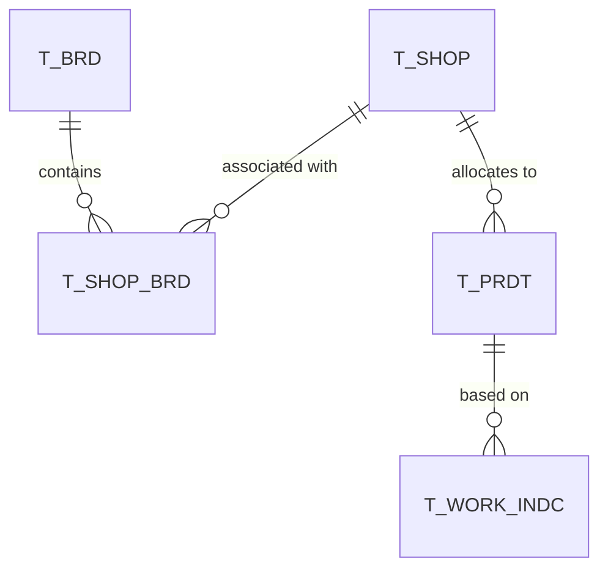

# 1. (전체) 기준정보_FAONE_Ver1.7_최종 요약 (데이터 모델 및 테이블 명세 분석)

이 문서는 [원문 엑셀 텍스트](file:///C:/supersonic/llm_wiki/raw/sources/extracted/1-faone-ver1-7-40d88e9b38_extracted.txt)를 바탕으로, FONE 및 AONE 시스템의 핵심 기준정보 테이블 명세를 분석하고, 기준정보 구조적 문제점을 **4단계 PI 프레임워크(As-Is, To-Be, Gap, 해결방안)**에 맞춰 정리한 지식 카드입니다.

---

## 📊 주요 테이블 구성 및 역할

FONE/AONE의 기준정보는 아래의 주요 테이블들을 바탕으로 전사 업무(기획, 생산, 영업, 매장, 공통)를 지원합니다.

* **T_BRD (브랜드 마스터)**: 브랜드 코드, 상위 브랜드, 사업본부/물류/온라인 등의 브랜드 그룹 정보 관리.
* **T_SHOP (매장 마스터)**: 매장 정보, 주소, 유통형태(백화점/대리점/직영 등), 마이너스 재고 허용 여부, 정산 방식(공급분/판매분/수수료) 관리.
* **T_PRDT (제품 마스터)**: 제품 고유 ID, 칼라, 저가 여부, 배분 여부, 원자재/부자재/임가공 추정 및 확정 원가 관리.
* **T_WORK_INDC (작업지시 마스터)**: 스타일 차수, 생산/원단 구매처, 납품처, 목표 생산배수, 목표원가, 분할입고 여부, 작지 발송 이력 관리.
* **T_COMN_CD (공통코드)**: 모코드-자코드 계층 구조를 가지는 시스템 공통 코드셋.
* **T_EMP (사원 마스터)**: 사원 기본 인적사항, 부서, 직무/직급 관리.

---

## 🗺️ 데이터 모델 관점의 4단계 PI 분석

### 1. 범용 속성(ATTR1 ~ ATTR16) 컬럼 남용

* **As-Is (현행)**: 
  * 테이블 설계 당시의 한계나 잦은 비즈니스 로직 변경으로 인해, 테이블 내 정의되지 않은 가변 속성을 `ATTR1` ~ `ATTR16`과 같은 범용 캐릭터 컬럼에 수기로 할당하여 사용 중입니다.
  * 예: `T_BRD`의 `ATTR1`(점간이동제한수), `ATTR2`(브랜드회계맵핑코드) / `T_SHOP`의 `ATTR6`(점간요청제외여부), `ATTR7`(출고통제대상여부), `ATTR8`(행낭코드) / `T_WORK_INDC`의 `ATTR2`(생산담당자ID), `ATTR3`(생산담당팀CD).
  * 컬럼의 명칭과 용도가 일치하지 않아 개발자 및 현업의 SQL 작성 시 실수 유발 및 가독성 저하를 초래합니다.
* **To-Be (목표)**: 모든 주요 비즈니스 제어 플래그와 속성을 명확한 의미의 영문/한글 물리 컬럼명으로 변경(Refactoring)하여 관리.
* **Gap (격차)**: 데이터 모델 확장성 고려 부재 및 메타데이터 관리 프로세스 미비.
* **RFP 해결방안**:
  * 차세대 FONE DB 설계 시 범용 `ATTR` 컬럼을 전수 리팩토링하여 실제 물리적 비즈니스 컬럼(예: `STOCK_MOVE_LIMIT_CNT`, `DELV_CTRL_YN`, `PO_DEPT_CD` 등)으로 정규화.
  * 신규 유연 속성 수용을 위해 동적 컬럼(EAV 모델 등) 또는 JSON 타입을 제한적으로 허용하는 설계 표준 수립.

---

### 2. FONE - AONE 테이블 스키마 중복 및 동기화 부재

* **As-Is (현행)**:
  * 신성통상(FONE)과 에이션패션(AONE)이 별도의 마스터 테이블(`T_BRD`, `T_SHOP` 등)을 격리 운영하며, 구조가 약 95% 이상 유사함에도 회사코드(`COMPY_CD` 기본값)나 일부 매핑 필드의 기본값만 다르게 적용되어 중복 유지보수가 발생합니다.
* **To-Be (목표)**: 전사 마스터 데이터 관점에서 단일 통합 스키마를 채택하고, 멀티테넌시 구조(회사코드별 데이터 격리)를 지원하여 마스터 기준정보를 일원화 관리.
* **Gap (격차)**: 인프라 분리 운영으로 인한 DB 인스턴스 단절 및 공통 데이터 모델링 표준 부재.
* **RFP 해결방안**:
  * **전사 MDM(Master Data Management) 마스터 허브**를 도입하여 데이터 모델을 일원화하고, FONE과 AONE의 데이터를 단일 테이블 내에서 회사코드(`COMPY_CD`) 식별자를 기반으로 논리 격리 및 통합 쿼리 체계 수립.
  * 공통 기준정보 변경 시 실시간 인터페이스 및 동기화 스케줄러 구축.

---

### 3. 기준 데이터 정합성 통제 결여 (마이너스 재고 및 반품 통제)

* **As-Is (현행)**:
  * `T_SHOP` 테이블 내 `MNS_STOCK_PERM_CLSBY`(마이너스재고허용구분), `MNL_RET_YN`(수기반품가능여부) 등의 제어 속성이 데이터 수준에서 정의되어 있으나, 애플리케이션 단에서 이에 대한 검증 로직이 불완전하게 구현되어 데이터 수준의 정합성이 상실되었습니다.
* **To-Be (목표)**: 기준정보 속성과 트랜잭션 처리(판매, 입고, 반품) 간의 완벽한 상호 통제 보장.
* **Gap (격차)**: 테이블 제어 필드와 비즈니스 트랜잭션 API 간의 연동 검증 로직 누락.
* **RFP 해결방안**: DB 제어 필드를 검증하는 **비즈니스 룰 엔진(Rule Engine)**을 API 서버 단에 필수 미들웨어로 구축하여, 마이너스 재고 방지 및 블라인드 반품 차단을 강제함.

---

## 🔗 연계 지식 카드 (Obsidian Links)

* **상위 개념**: [[master-data-governance|기준정보 관리 체계]], [[fone-as-is-analysis|FONE 현행 분석]]
* **하위 개념**: [[store-master-data-cleanup|매장 마스터 정리]], [[product-master-data-cleanup|상품 마스터 정리]]
* **연계 엔티티**: [[fa-one-fone|FA-ONE & FONE ERP]]
