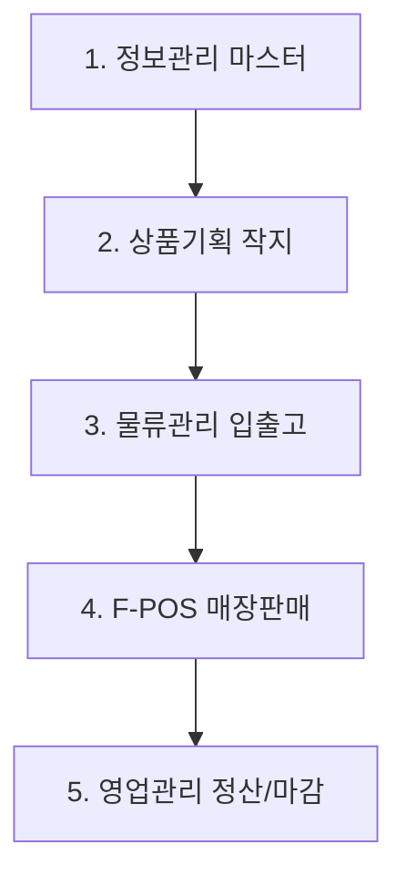

# FA-ONE 패션관리시스템 프로세스 정의서 요약

이 문서는 [원문 PDF 텍스트](file:///C:/supersonic/llm_wiki/raw/sources/extracted/20260327-process-86845c5311_extracted.txt)를 바탕으로 작성되었습니다. 본 정의서는 신성통상 IT기획팀에서 2026년 3월에 정리한 패션관리 시스템(FA-ONE)의 기능 구조와 핵심 프로세스(정보관리, 상품기획, 물류관리)를 진단하고, 업무 흐름상 병목과 Pain Point를 **4단계 PI 프레임워크(As-Is, To-Be, Gap, 해결방안)**에 맞춰 정리한 지식 카드입니다.

---

## 🏢 FA-ONE 업무 영역별 프로세스 맵

---

## 🔍 영역별 4단계 PI 진단 및 개선 과제

### 1. 정보관리 (기준정보 마스터) 영역

#### 📌 브랜드 및 세부 칼라/사이즈 정비
* **As-Is (현행)**:
  - **브랜드**: 브랜드와 서브브랜드 코드가 물리적으로 강결합(알파벳 A~Z 구조)되어 확장 포화 상태(잔여 코드 4개: Q, S, T, W).
  - **칼라**: 총 칼라 1,434개 중 미사용 칼라가 784개에 달해 마스터 정리가 부재하며 데이터 정합성이 저하됨.
  - **매장 ID**: 브랜드+유통형태+상권+SEQ 형태의 규칙으로 구성되나, 규칙 적용을 수기로 입력하고 있어 오채번 및 오입력 오류가 빈번함.
  - **매장 이력**: 매장 정보의 상세 변동 이력(SCD) 히스토리 관리가 부재하여 과거 시점 정산/비교 시 어려움 발생.
* **To-Be (목표)**: 확장 가능한 브랜드 구조, 정제된 칼라/사이즈 마스터, 매장 마스터 이력 자동화 및 부서별 입력 권한 분리.
* **Gap (격차)**: 코드 체계 유연성 결여, 마스터 데이터 거버넌스 및 Workflow 제어 장치 부족.
* **RFP 해결방안**:
  - 브랜드 및 서브브랜드에 숫자 코드 체계를 결합하여 조합 수 1,225가지로 대폭 확장 (`[[fone-c348c1c5d9|브랜드 코드 체계 확장안]]`).
  - 미사용 마스터 데이터 일괄 정리 및 매장 마스터 등록 시 부서별 R&R 탭(Tab) 분리.
  - 매장 ID 자동 채번 엔진 및 Slowly Changing Dimension(SCD Type 2) 기반 속성 변동 이력 DB화.

---

### 2. 상품기획 (작업지시서 관리) 영역

#### 📌 수작업 기반 작업지시 및 바코드/TAG 발주
* **As-Is (현행)**: 상품기획팀에서 품번 채번 및 기본 속성 입력 후, 디자인팀이 스케치 및 사이즈 스펙을 업로드하여 소싱(S-ONE) 시스템으로 전달. 소싱에서 자재 구매 및 사전원가를 확정하여 선적 전까지 물류 입고 예정 정보를 수기로 연동함. 또한, 매장 RFID/TAG 발주가 브랜드별 특성에 따라 수기 처리되어 지연 발생.
* **To-Be (목표)**: 기획-작지-소싱 간 단일 플랫폼(PLM) 기반 실시간 연계 및 RFID 기반 TAG 발주 자동화.
* **Gap (격차)**: 기획-디자인-생산-물류 연계 워크플로우의 단절 및 협업 이력 추적 불가.
* **RFP 해결방안**: 
  - **Centric PLM 도입**을 통한 제품 라이프사이클 통합 및 정보의 일관성 유지.
  - RFID 태그 발주 자동화 기능 구축 (`[[영업관리_2차_심화인터뷰_질문지|RFID/TAG 발주 개선안]]`).

---

### 3. 물류관리 (입/출고 및 자가소모) 영역

#### 📌 수동 물량 배분 및 WMS 창고 코드 불일치
* **As-Is (현행)**:
  - **창고 불일치**: ERP(FA-ONE)와 WMS 간의 창고 기준정보와 매핑 방식이 상이하여 재고 이동 및 온라인 수불 처리가 불명확함. 
  - **자가소모**: 매장 또는 온라인(B2C)에서 자가소모(증정, 비품 등) 처리 시 **반드시 물류센터로 실물 재고를 선 이동(반품)** 처리한 후 자가소모를 확정해야 하는 심각한 비효율성(물류비 낭비, 행정 지연) 발생.
* **To-Be (목표)**: 물류-ERP 창고 정보의 완전 동기화 및 매장 현장 완결형 자가소모 처리.
* **Gap (격차)**: 소프트웨어적 가상 창고 개념의 부재 및 매장 스마트 단말기(POS)의 비용 전표 연동 결여.
* **RFP 해결방안**:
  - **2026년 7월 개선 예정인 WMS-FONE 창고 코드 일원화** 사업 추진.
  - **매장 자가소모 직접 처리 프로세스** 구현: 매장에서 직접 자가소모 등록 시 물류센터 실물 반품 없이 POS/App 단말을 통해 실시간 비용(판촉비 등) 및 재고 즉시 차감 (`[[영업관리_RFP_요구사항_정의서_최종|REQ-INV-002 자가소모 프로세스]]`).

---

## 🔗 연계 지식 카드 (Obsidian Links)
* **상위 아키텍처**: [[fa-one-73077b7a31|FA-ONE 시스템 분석 및 개선 전략]]
* **직접 도출 요구사항**: [[영업관리_RFP_요구사항_정의서_최종|영업관리 RFP 요구사항 정의서]]
* **연계 시스템**: [[wms|WMS 창고관리]], [[centric-plm|센트릭 PLM]]
