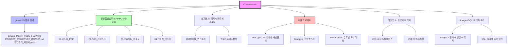

# Project Structure Visual Map

```mermaid
graph TD
    Root[C:\supersonic] --> PI[gemcli: PI 분석 결과]
    Root --> Work[신성통상업무: ERP/POS/산출물]
    Root --> Ref[참고문서: 레거시/프로세스/DB]
    Root --> Projects[개발 프로젝트]
    Root --> Personal[개인/인사: 증명서/이력서]
    Root --> Assets[images/SQL: 이미지/쿼리]

    PI --> PI_Files["SALES_MGMT_TOBE_FLOW.md<br/>PROJECT_STRUCTURE_REPORT.md<br/>영업관리_제안서.pptx"]
    
    Work --> ERP[01.시스템_ERP]
    Work --> POS[02.POS_키오스크]
    Work --> Outputs[03.프로젝트_산출물]
    Work --> Infra[04.IT조직_인프라]
    
    Ref --> DB[업무테이블_연관분석]
    Ref --> Process[업무프로세스분석]
    
    Projects --> FM[next_gen_fm: 차세대 패션관리]
    Projects --> FS[fsproject: IT 운영관리]
    Projects --> WM[worldmonitor: 글로벌 모니터링]
    
    Personal --> Doc[개인: 자동차/통장/가족]
    Personal --> HR[인사: 이력서/채용]
    
    Assets --> Img[images: 4월 이후 인입 이미지]
    Assets --> Queries[SQL: 일자별 쿼리 이력]
    
    style Root fill:#f9f,stroke:#333,stroke-width:4px
    style PI fill:#bbf,stroke:#333,stroke-width:2px
    style Work fill:#bfb,stroke:#333,stroke-width:2px
    style Projects fill:#fbb,stroke:#333,stroke-width:2px
```
