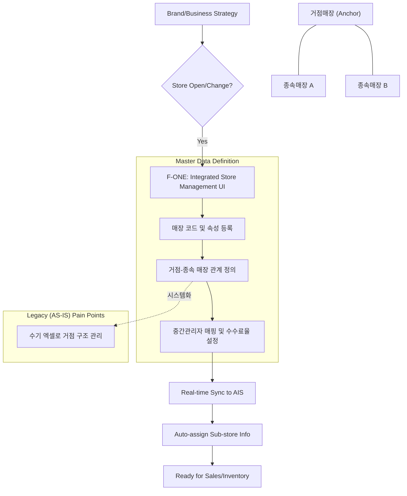
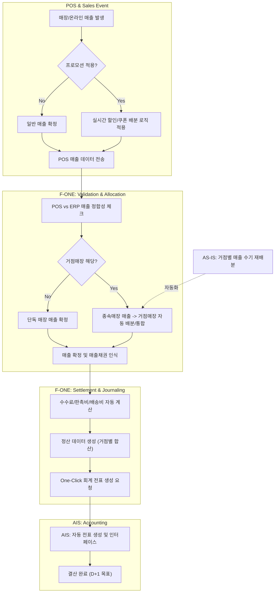
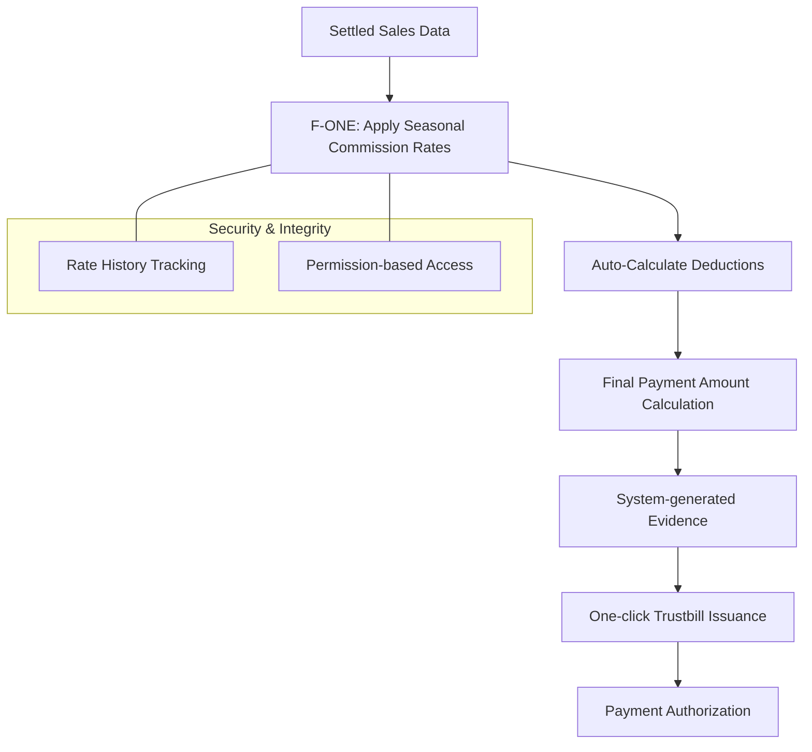
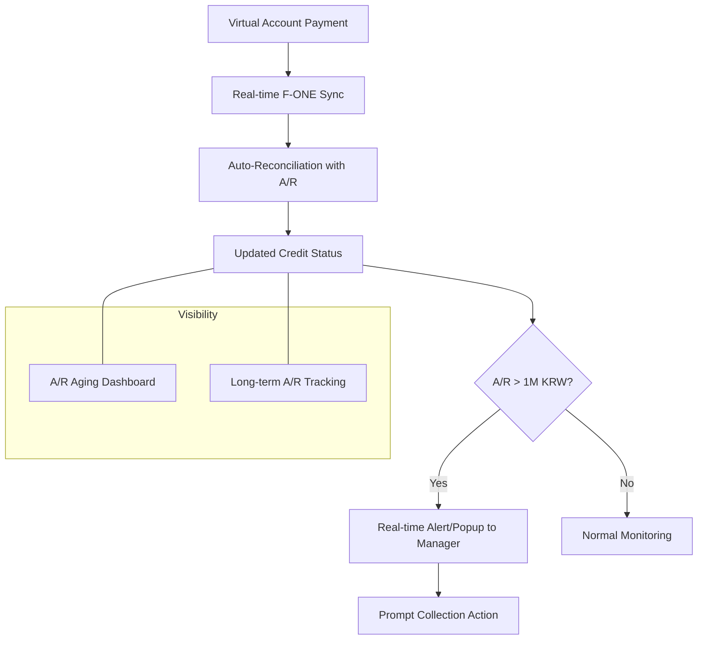
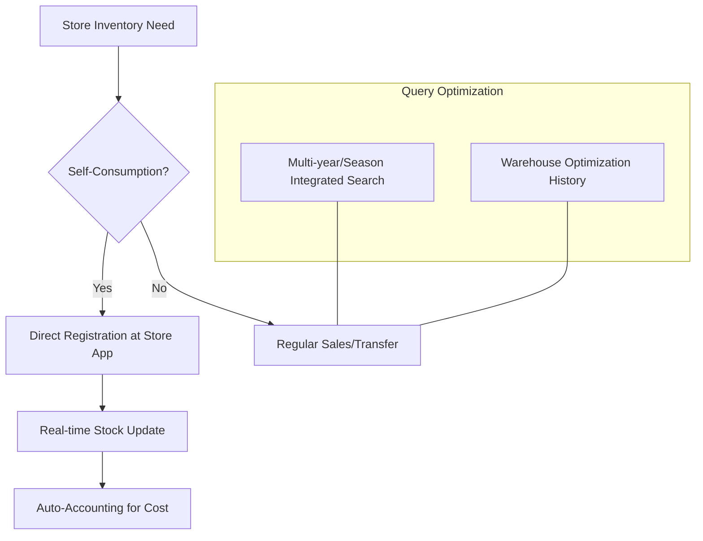

# Sales Management (영업관리) TO-BE Process Flow

This document visualizes the optimized TO-BE processes for the Next-Gen ERP system, focusing on automation, real-time data sync, and efficiency.

---

## 1. Store & Master Data Management (매장 기준정보)
**Goal:** 매장 코드 중심의 통합 라이프사이클 관리 및 거점-종속(Hub-Spoke) 구조 체계화.

---

## 2. Sales & Settlement (매출 및 정산)
**Goal:** POS-ERP 실시간 매출 연동, 거점매장 매출 자동 배분, 결산 자동화.

---

## 3. Commission Management (중간관리자)
**Goal:** Automated deduction calculation and seamless tax invoice (Trustbill) issuance.

---

## 4. A/R & Credit Management (미수금/채권)
**Goal:** Real-time credit monitoring and automated warning system for proactive collection.

---

## 5. Inventory & Stock Management
**Goal:** Simplified self-consumption processing and expanded visibility across multiple years/seasons.

