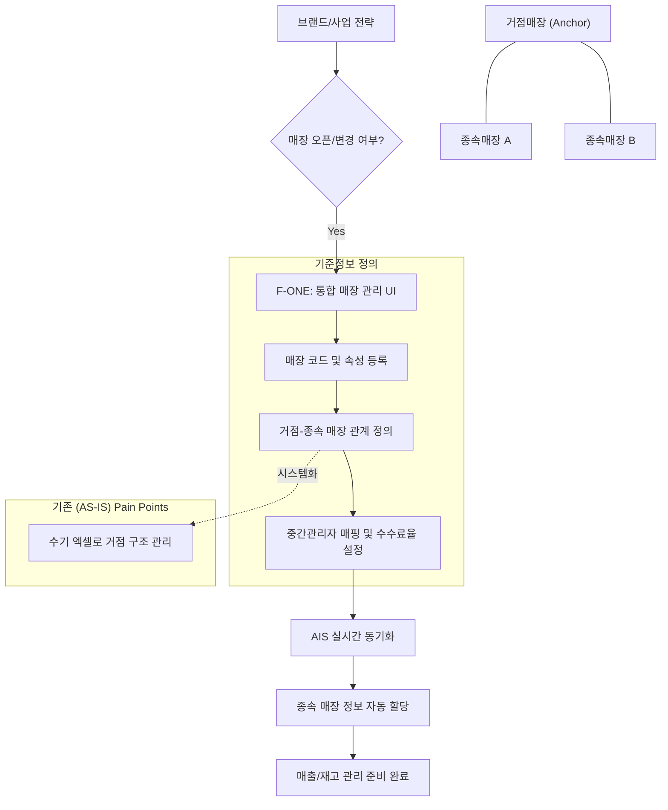
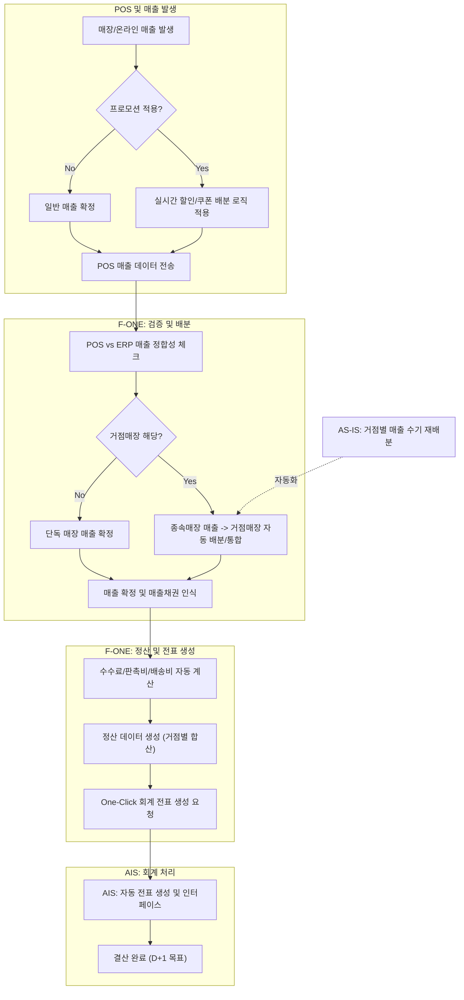
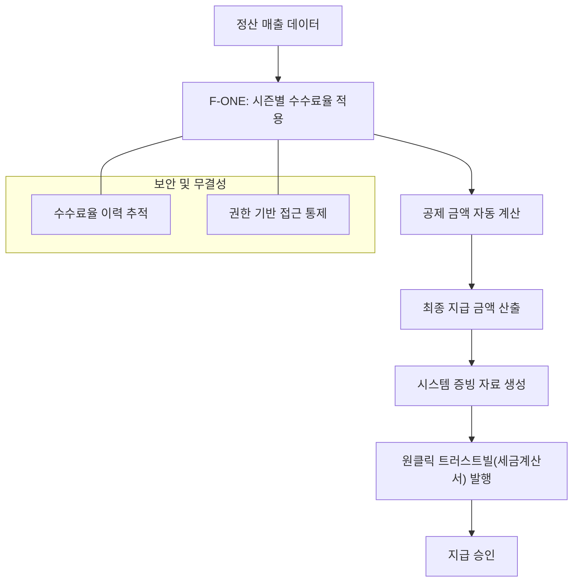
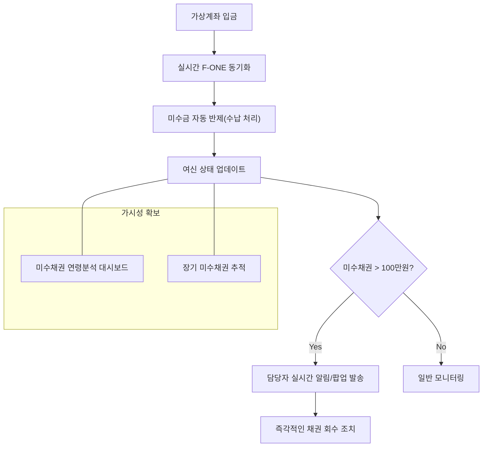
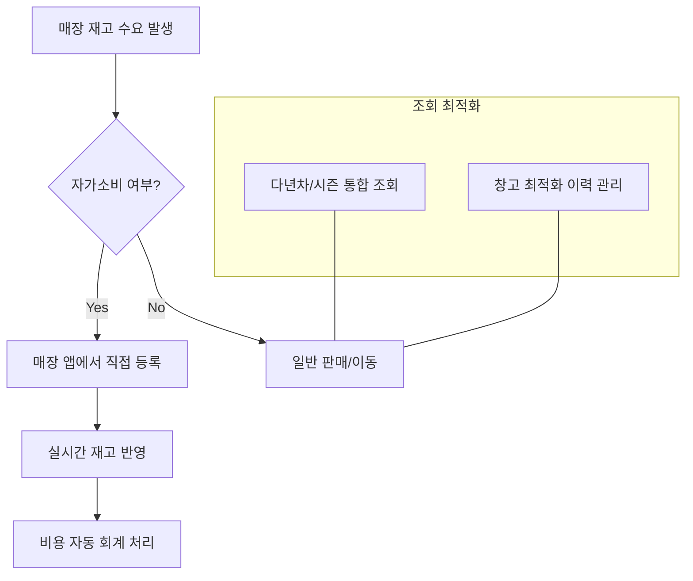

# 영업관리 (Sales Management) TO-BE 프로세스 흐름도

이 문서는 자동화, 실시간 데이터 동기화 및 업무 효율성에 초점을 맞춘 차세대 ERP 시스템의 최적화된 TO-BE 프로세스를 시각화합니다.

---

## 1. 매장 및 기준정보 관리 (Store & Master Data Management)
**목표:** 매장 코드 중심의 통합 라이프사이클 관리 및 거점-종속(Hub-Spoke) 구조 체계화.

---

## 2. 매출 및 정산 (Sales & Settlement)
**목표:** POS-ERP 실시간 매출 연동, 거점매장 매출 자동 배분, 결산 자동화.

---

## 3. 중간관리자 수수료 관리 (Commission Management)
**목표:** 자동화된 공제액 계산 및 원활한 세금계산서(트러스트빌) 발행.

---

## 4. 미수금 및 채권 관리 (A/R & Credit Management)
**목표:** 실시간 채권 모니터링 및 선제적 채권 회수를 위한 자동 경고 시스템 구축.

---

## 5. 재고 및 수불 관리 (Inventory & Stock Management)
**목표:** 자가소비 처리 프로세스 간소화 및 다년차/시즌 통합 재고 조회 가시성 확대.

