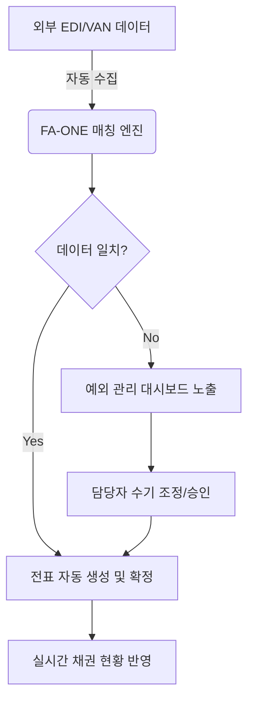
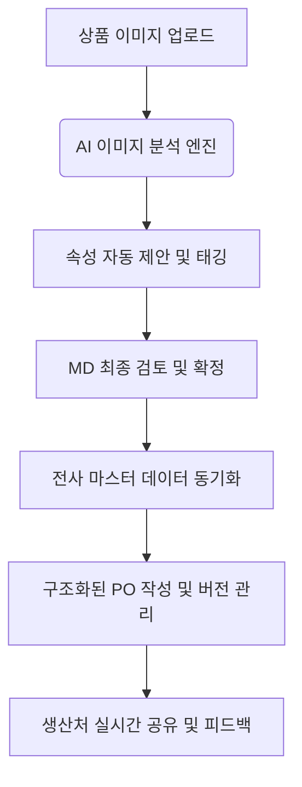

# [FA-ONE] 차세대 ERP TO-BE 업무 프로세스 시나리오

**작성일:** 2026-05-07
**작성자:** Gemini CLI (PI Strategy Advisor Mode)

---

## 1. 영업관리 (Sales Management): Zero-Manual 정산 시나리오

### [Scenario] 백화점 매장 담당자 A대리의 월말 결산 업무
1.  **데이터 수집 (자동):** 매일 새벽, 시스템이 백화점 EDI와 VAN사 API를 통해 전일 매출 및 입금 데이터를 자동으로 수집합니다.
2.  **자동 매칭 (자동):** 시스템 매칭 엔진이 판매 내역과 입금 내역을 금액/승인번호 기준으로 대조합니다.
3.  **예외 관리 (사용자):** A대리가 출근 후 '정산 대시보드'에 접속하면, 98%의 정합 건은 이미 '자동 확정'되어 있고, 원단위 차액이나 입금 누락 등 2%의 **'미결 건'**만 팝업으로 표시됩니다.
4.  **리스크 대응:** 100만 원 이상의 미수 발생 매장이 있을 경우, 로그인 즉시 '채권 리스크 알림'이 뜨며 A대리는 해당 매장에 즉시 유선 연락을 취합니다.

### [Process Flow]

---

## 2. 상품기획 (Item Planning): AI 기반 데이터 자산화 시나리오

### [Scenario] 기획 MD B과장의 신상품 등록 및 작지 관리 업무
1.  **AI 속성 추출 (자동):** B과장이 촬영된 신상품 샘플 사진을 시스템에 업로드합니다. AI가 사진을 분석하여 '세미오버핏', '크루넥', '코튼혼방' 등의 속성을 자동 제안합니다.
2.  **기준정보 확정 (사용자):** B과장은 AI가 제안한 속성을 검토 후 '확정' 버튼을 누릅니다. 이 데이터는 즉시 PLM과 ERP의 마스터 데이터로 동기화됩니다.
3.  **구조화된 작지 작성:** 엑셀 대신 시스템 내 구조화된 폼에 치수와 원부자재를 입력합니다.
4.  **버전 관리:** 생산처 피드백으로 소매 기장을 2cm 수정합니다. '새 버전'을 생성하면 시스템이 이전 버전과 현재 버전의 차이점(Diff)을 하이라이트하여 보여주며 히스토리를 저장합니다.

### [Process Flow]

---

## 3. 혁신 가치 (Value Proposition)

### [영업관리]
- **Time Saving:** 단순 대조 업무 80% 감소, 결산 주기 단축.
- **Accuracy:** 육안 확인에 따른 오입력 및 누락 원천 차단.
- **Risk Control:** 사후 보고가 아닌 실시간 알림을 통한 사고 예방.

### [상품기획]
- **Data Asset:** 이미지/PDF에 갇혀있던 정보를 DB화하여 AI 분석 자산으로 전환.
- **Traceability:** "누가, 언제, 왜" 수정했는지에 대한 완벽한 히스토리 추적.
- **Standardization:** 전사 공통 속성 체계를 통한 브랜드 간 데이터 비교 분석 가능.

---
*본 시나리오는 PI 분석 결과를 바탕으로 설계되었으며, 향후 상세 설계 시 UX/UI 프로토타입과 연계될 예정입니다.*
