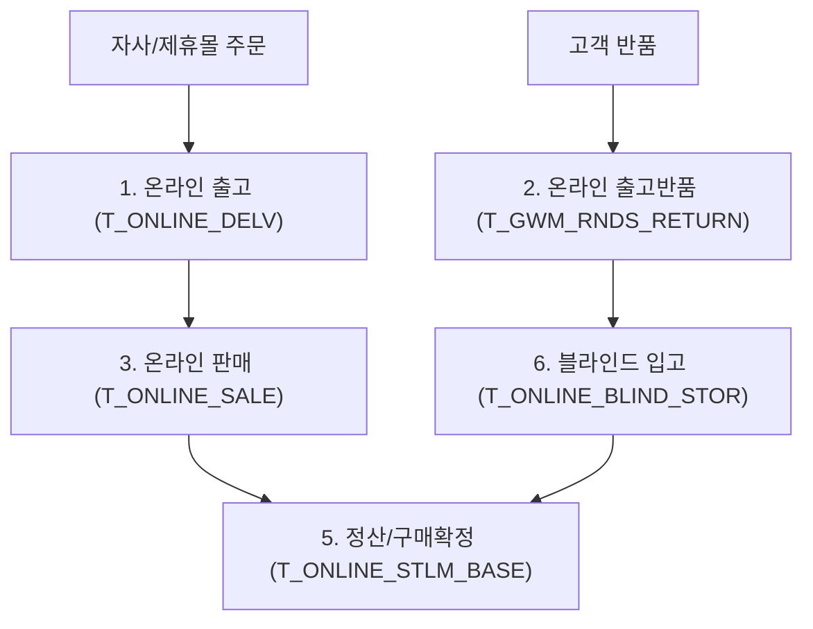

# 온라인 정산 AS-IS/TO-BE 프로세스 비교 요약

이 문서는 [원문 PPTX 텍스트](file:///C:/supersonic/llm_wiki/raw/sources/extracted/as-is-to-be-761c70f811_extracted.txt)를 바탕으로 작성되었습니다. 본 자료는 온라인 채널(자사몰인 굿웨어몰 및 제휴몰)의 출고, 반품, 판매, 정산 마감 프로세스에 대한 데이터베이스 테이블 및 Stored Procedure(SP) 수준의 현행 대비 개선 매핑 상세 설계 자료를 **4단계 PI 프레임워크(As-Is, To-Be, Gap, 해결방안)**에 맞추어 요약한 지식 카드입니다.

---

## 🗺️ 온라인 정산 데이터 흐름 및 핵심 매핑 구조

---

## 🔍 프로세스 단계별 4단계 PI 비교 분석

### 1. 온라인 출고 (슬라이드 2)
* **As-Is (현행)**: 온라인 출고 실적 적재 시 가상 매장코드(`STS027` 등)를 강제 경유하여 거점 매장 반품 출고 등의 복잡한 논리적 우회 흐름을 탐으로써, 실제 수불 장부(`T_SHOP_RNDS_BASE`)와 물리 재고의 불일치를 초래함.
* **To-Be (목표)**: 온라인 매장과 실물 창고 간의 다이렉트 출고 처리 및 데이터 무결성 확보.
* **Gap (격차)**: 독립적인 온라인 전용 출고 테이블 및 직접 수불 트랜잭션 부재.
* **RFP 해결방안**:
  - 온라인 전용 출고 테이블(`T_ONLINE_DELV`) 및 전송 스펙(`T_TRAN_SPEC`) 신설.
  - 가상매장 우회 없이 가상 창고(`OA` 또는 `ON` 창고)에서 온라인 매장으로 직접 출고 수불 전표 생성.

### 2. 온라인 출고 반품 및 블라인드 입고 (슬라이드 3, 6)
* **As-Is (현행)**: 
  - **출고 반품**: 반품 수량과 금액의 우회 처리로 데이터 왜곡 발생.
  - **블라인드 입고**: 주문 정보(Order ID)가 없거나 사전 예약되지 않은 고객의 무단 반품(블라인드 반품) 시 실물은 WMS에 입고되나 F-ONE ERP에 반영되지 않아 데이터 유실 및 수기 마감 조정을 야기함.
* **To-Be (목표)**: 예약/미예약 반품의 구분을 통한 가입고 프로세스 정립 및 사후 자동 매칭.
* **Gap (격차)**: 미예약 반품 임시 적재 테이블 및 사후 배치 주문 매칭 프로그램 부재.
* **RFP 해결방안**:
  - **온라인 블라인드 입고 테이블(`T_ONLINE_BLIND_STOR`)**을 신설하여 가입고(블라인드) 실적을 선 적재.
  - **블라인드 주문 매칭 룰 및 테이블(`T_GWM_IF_RET_FAK_MATCH`)**을 구축하여, 사후 주문 연동 시 자동으로 입고 실적을 연결하여 정식 출고반품(`T_GWM_RNDS_RETURN`)으로 자동 전환 및 종결 처리.
  - 미매칭 건은 별도 관리 미칭 리스트(`MATCH_MISS`)로 격리하여 예외 관리.

### 3. 온라인 판매 및 판매 반품 (슬라이드 4, 5)
* **As-Is (현행)**: 자사몰과 제휴몰 판매 실적이 F-ONE 내 단일 매출 테이블에 혼재하여 적재되어, 수수료 정산 및 매출 귀속 처리를 위해 마감 시 담당자가 수작업 분류 작업을 거쳐야 함.
* **To-Be (목표)**: 판매 시점부터 자사몰 및 제휴몰 채널 분리 적재 및 자동화.
* **Gap (격차)**: 온라인 판매 채널 다차원 분류 및 마진율별 분기 처리 기능 미비.
* **RFP 해결방안**:
  - 온라인 판매 테이블(`T_ONLINE_SALE`) 분리 구축.
  - 자사몰 판매(`T_GWM_SALE_SHOP_RNDS`)와 제휴몰 판매를 최초 인터페이스(BO 수집) 단계부터 구분하여 분기 적재 및 Stored Procedure(`SP_IFT_ONLINE_SALE_RST`) 자동화.

### 4. 자사몰 구매 확정 및 제휴몰 정산 마감 (슬라이드 7)
* **As-Is (현행)**: 정산서 상에 주문번호가 누락되거나 주문금액과 정산금액이 불일치하는 경우, 담당자가 일일이 수작업 대조 후 당월 데이터를 마이너스 반품 처리하고 익월 1일자로 강제 재등록(이월 처리)하는 극심한 수기 보정 공정 발생.
* **To-Be (목표)**: 매칭 룰(Rule)에 따른 3-Way Auto-Matching 및 예외 케이스 시스템 자동 정산 처리.
* **Gap (격차)**: 정산서 매칭 및 차액 자동 상계 전표 처리 엔진 부재.
* **RFP 해결방안**:
  - **온라인 정산 기본 테이블(`T_ONLINE_STLM_BASE`)** 및 정산 자동 처리 엔진 구축.
  - **자동 정산 Rule 구현**:
    1. 주문번호가 있고 금액이 일치하는 경우 ➡️ 자동 정산 확정 (Zero-Touch).
    2. 주문금액과 정산금액 불일치 시 ➡️ 이전 정산 이력 여부를 체크하여 차액만 마지막 일자로 자동 가품번 전표 생성하여 보정.
    3. 주문번호가 없고 정산 금액만 존재하는 예외 건 ➡️ 매장별 총합 정산액이 0이면 자동 스킵 종결, 0이 아니면 최종일자로 가품번 자동 반영하여 정산 마감.
  - **자사몰(굿웨어몰) 구매 확정**: 쇼핑몰 BO 인터페이스 테이블(`T_GWM_IF_CAL_ORD_CLM_GOD`) 수신 즉시 구매 확정 수량/일자 기준 자동 전표 재생성 및 매장 수불 연동 (`SP_GWM_SALE_SHOP_RNDS_CONFIRM`).

---

## 🔗 연계 지식 카드 (Obsidian Links)
* **상위 개념**: [[sales-settlement-automation|영업관리 정산 자동화]]
* **직접 도출 요구사항**: [[영업관리_RFP_요구사항_정의서_최종|영업관리 RFP 요구사항 정의서 (REQ-SLS-002, REQ-DOC-001)]]
* **현업 요구사항**: [[resource-2537e80af1|차세대 영업관리시스템 요청사항 (SA-01~03, CM-02)]]
* **연계 시스템**: [[wms|WMS 창고관리]]
