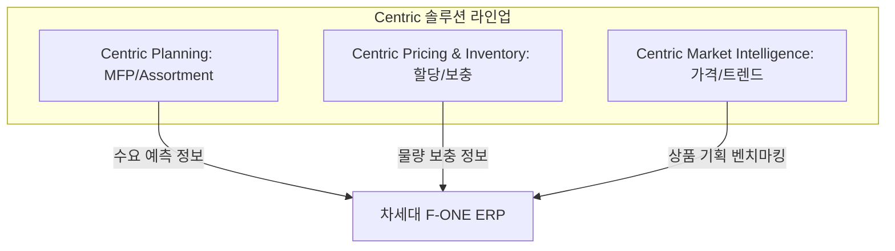

# Centric_솔루션_분석 요약 (수요예측 및 타사 벤치마킹 분석)

이 문서는 [원문 텍스트](file:///C:/supersonic/llm_wiki/raw/sources/extracted/centric-ebd6abd12a_extracted.txt)를 바탕으로, 글로벌 패션 PLM 및 리테일 예측 솔루션인 Centric의 핵심 기능과 신성통상 차세대 ERP 연동 전략을 **4단계 PI 프레임워크(As-Is, To-Be, Gap, 해결방안)**에 맞추어 요약한 지식 카드입니다.

---

## 🧭 Centric 리테일 솔루션 기능 4단계 PI 분석

### 1. 경쟁사 분석 및 가격 전략 수립의 수작업 의존 (As-Is)

* **As-Is (현행)**:
  * 시장 및 경쟁사의 신상품 출시 현황, 가격 책정, 할인율 분석이 MD나 디자이너의 수기 매장조사 및 단편적인 리서치에 의존하여 진행되어 대응 리드타임이 늦고 마진 손실 위험이 존재합니다.
  * pre-season(시즌 전) 초도 할당 및 in-season(시즌 중) 매장 물량 보충 수요 예측이 시스템화되지 못해 직관에 의존한 배분이 강제되고 결품 및 과잉 재고가 상시 발생합니다.
* **To-Be (목표)**: AI 엔진 기반 시장 데이터 실시간 크롤링 및 이미지 분석을 통한 벤치마킹 자동화, 과학적 수요 예측 기반 물량 할당 및 보충 최적화 체계 구축.
* **Gap (격차)**: 웹 크롤링 및 이미지 인식 알고리즘을 활용한 지능형 마켓 인텔리전스 도구 부재, AI 기반 전사 리테일 수요 예측(Planning) 모듈 부재.
* **해결방안 (RFP 요구사항)**:
  * **Centric Market Intelligence (구 StyleSage) 도입**:
    * 전 세계 리테일 사이트 매일 크롤링하여 경쟁사의 가격, 할인율, 신상품 라이프사이클 실시간 모니터링 체계 가동.
    * **AI 이미지 매칭(Image Recognition)** 기술을 적용하여 99% 정확도로 경쟁사 유사 제품과 자사 제품 가격/구성을 자동 비교 분석하고 전략 가격 책정 가이드 제공.
  * **Centric Planning (구 Armonica) 도입**:
    * 과거 판매 이력과 트렌드 데이터를 바탕으로 재무 계획(MFP) 및 상품 구색 계획(Assortment Planning) 수립 최적화.
  * **Centric Pricing & Inventory 도입**:
    * 시즌 전 초도 할당량 시뮬레이션 및 시즌 중 실시간 재고 보충 수요를 90% 정확도 목표의 AI 모델로 계산하여 ERP 배분 모듈과 인터페이스.
  * **FONE ERP와의 연동 표준**:
    * Centric Planning의 기획 및 수요예측 데이터를 ERP 제품 마스터(`T_PRDT`) 및 배분 스케줄러와 연계하여 생산 수량 도출 및 물류 배송 지시 자동화.

---

## 🔗 연계 지식 카드 (Obsidian Links)

* **상위 개념**: [[plm-fone-integration|PLM-FONE 연계]], [[fone-as-is-analysis|FONE 현행 분석]]
* **연계 엔티티**: [[centric-plm|Centric PLM]], [[fa-one-fone|FA-ONE & FONE ERP]]
* **관련 프로세스**: [[product-master-data-cleanup|상품 기준정보 정비]]
