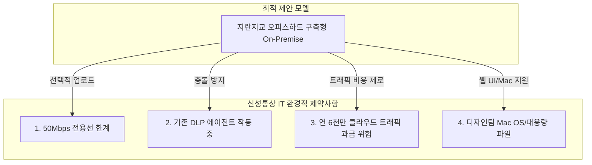

# 신성통상 차세대 ECM 솔루션 도입 검토 요약

이 문서는 [신성통상_ECM도입안.html](file:///C:/supersonic/신성통상업무/IT부문/팀별자료/IT기획팀/1.IT기획팀/IT부문프로젝트/ECM도입/신성통상_ECM도입안.html) 및 [ECM관련 3사 솔루션비교.html](file:///C:/supersonic/신성통상업무/IT부문/팀별자료/IT기획팀/1.IT기획팀/IT부문프로젝트/ECM도입/ECM관련 3사 솔루션비교.html)을 바탕으로, 당사의 인프라 환경적 한계를 진단하고 최적의 문서보안/자산화 솔루션을 도출한 내용을 **4단계 PI 프레임워크(As-Is, To-Be, Gap, 해결방안)**에 맞추어 정리한 지식 카드입니다.

---

## 🧭 차세대 ECM 도입 4단계 PI 분석

### 1. 인프라 및 보안 환경의 심각한 제약 (As-Is)

* **As-Is (현행)**:
  * 본사-IDC 간 전용선이 **50Mbps** 저대역폭으로 제한되어 있어, 1,000여 명의 임직원 파일이 강제 중앙화 방식으로 네트워크를 탈 경우 심각한 병목 현상이 발생하여 사내 인터넷 및 업무 처리가 마비될 우려가 큽니다.
  * 이미 사내 PC에 매체제어용 자체 DLP 에이전트와 백신이 기 가동 중이므로, 커널 레벨의 디바이스 I/O 필터링을 제어하는 보안 솔루션 도입 시 PC 블루스크린(BSOD) 및 치명적 에이전트 충돌 위험이 상존합니다.
  * 디자인 부서에서 생성되는 대용량 디자인 원본 파일(CAD, AI, 영상 등 1GB 이상) 트래픽으로 인해 AWS S3 등 퍼블릭 클라우드 이용 시 연간 6천만 원 이상의 과도한 트래픽 전송 요금(Outbound Traffic Cost) 리스크가 존재합니다.

### 2. 안정성 및 비즈니스 연동을 극대화한 통합 스토리지 (To-Be)

* **To-Be (목표)**: 에이전트 충돌이 없고 네트워크 부하를 최소화한 프라이빗 스토리지 체계 구축 및 회계 전표/그룹웨어 결재 프로세스와 연동된 공통 실물 증빙 자동화 구현.

### 3. 핵심 아키텍처 및 기능 격차 (Gap)

* **Gap (격차)**:
  * 강제 중앙화(다큐원, 시큐어디스크) 모델 채택 시 대역폭 한계 및 기존 DLP 충돌 극복 불가능.
  * 이스트시큐리티의 경우 디자인 부서의 필수 조건인 **Mac OS 에이전트 미지원**.
  * 타 솔루션의 경우 SaaS/클라우드 위주의 일방적 API 정책으로 인해 당사 회계/그룹웨어와의 맞춤형 연동이 어려움.

### 4. 솔루션 비교 분석 및 요건 구체화 (RFP 해결방안)

* **최종 선정 솔루션**: **지란지교시큐리티 '오피스하드(OfficeHard)' 구축형 (On-Premise)**
* **RFP 해결방안**:
  1. **보안 인프라 공존화 및 안정성 확보**: 
     - 저장소 중심의 보안 웹하드 방식(`OfficeHard`)을 도입하여 로컬 제어는 기존 DLP에 일임하고 에이전트 간 마찰(커널 I/O 간섭)을 원천 방어.
     - 본사 서버 인프라에 직접 설치하는 온프레미스 방식으로 퍼블릭 클라우드 트래픽 과금 제거.
  2. **E2E 증빙 연동 API 파이프라인 구현**:
     - 손승훈 과장 주도 하에 개발 중인 전표 통합 UI와 신규 ECM 간의 실시간 API 통합.
     - **연동 흐름**: `[회계 시스템 전표 생성 시 증빙 팝업 호출]` ➔ `[인보이스/B.L 업로드 시 Base64 API를 통해 ECM 적재]` ➔ `[다우 그룹웨어 기안문 HTML 내 파일 식별 ID를 파라미터로 매핑하여 기안/결재자가 원클릭으로 실물 증빙(GET) 조회]`.
  3. **디자인팀 대용량 PoC(Proof of Concept) 수행**:
     - 50Mbps 대역폭 환경에서 디자인 부서의 대용량 파일(1GB 이상 일러스트/CAD)에 대해 전용 가상 드라이브 상의 직접 편집(Direct Edit) 안정성(프리징, 파일 파손 유무) BMT를 통과할 것을 벤더사에 필수 기술 요건으로 제시.

---

## 🔗 연계 지식 카드 (Obsidian Links)

* **상위 개념**: [[master-data-governance|기준정보 관리 체계]], [[fone-as-is-analysis|FONE 현행 분석]]
* **연계 프로젝트**: [[rfp-20260424-06e9cd0154|영업관리_RFP_요구사항_정의서(20260424)]]
* **연계 부서**: [[fa-one-40b4a2bfe5|차세대_FA-ONE_현업인터뷰_대상_및_세부질문지]] (IT팀 진단 요건)
* **연계 엔티티**: [[fa-one-fone|FA-ONE & FONE ERP]]
