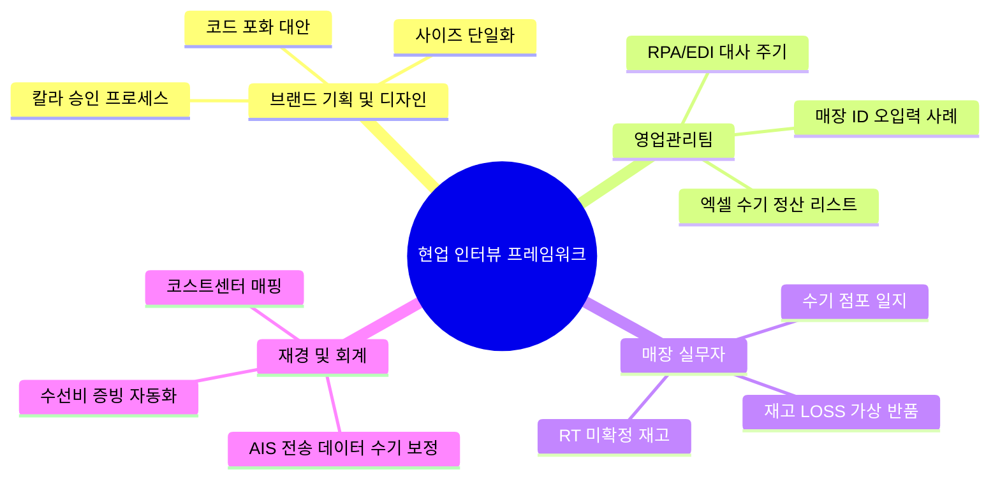

# 차세대_FA-ONE_현업인터뷰_대상_및_세부질문지 요약

이 문서는 [원문 텍스트](file:///C:/supersonic/llm_wiki/raw/sources/extracted/fa-one-40b4a2bfe5_extracted.txt)를 바탕으로, 차세대 FONE 시스템 설계를 위해 각 현업 부서의 숨겨진 Pain Point와 수기 프로세스를 도출하기 위한 인터뷰 핵심 질문과 분석 로드맵을 **4단계 PI 프레임워크(As-Is, To-Be, Gap, 해결방안)**에 맞추어 종합 재구성한 지식 카드입니다.

---

## 🧭 현업 인터뷰 설계를 위한 4단계 PI 분석

### 1. 인터뷰 수행 배경 및 구조적 문제점 (As-Is)

* **As-Is (현행)**:
  * 차세대 프로젝트 기획 단계에서 현업의 실질적 고충(수기 엑셀, 비공식 장부, 비표준 데이터 보정 등)을 파악하는 객관적 프레임워크와 방법론이 명확하지 않아 인터뷰가 단편적인 요구사항 수집 수준에 그칠 우려가 큽니다.
  * 현업 부서별(상품기획, 영업관리, 매장, 재경, IT) 고유 고충점이 전사적인 맥락에서 연계되지 않고 격리(Silo)되어 있습니다.

### 2. 현장 보이스 수집 체계 구축 (To-Be)

* **To-Be (목표)**: 전사 프로세스 단절 지점과 휴먼 에러 원인을 명확하게 규명하기 위한 **표준 인터뷰 질문 체계 및 2주 단기 집중 심층 분석 프로세스** 가동.

### 3. 영역별 주요 진단 및 연계 쟁점 (Gap)

* **Gap (격차)**: 부서간 데이터 연동 흐름에서 발생하는 비정형 업무 및 예외 케이스의 체계적 발견 방법 부재.
  * **기획-영업관리**: 기획 마스터 수기 재입력 여부.
  * **매장-물류**: 재고 LOSS 처리를 위한 '가상 반품' 등 전산 편법으로 인한 리소스 낭비.
  * **영업관리-재경**: 영업용 코드(매장/브랜드)와 회계용 코드(코스트센터/계정)의 불일치로 인한 수기 매핑 보정 작업 발생.

### 4. 인터뷰 및 분석 요건 구체화 (RFP 해결방안)

* **RFP 해결방안**:
  * **5대 부서별 집중 질문 가이드 수립**:
    1. **브랜드 기획/디자인**: 브랜드 코드 2자리 확장, 칼라/사이즈 마스터 정리 영향도.
    2. **영업관리**: 수기 정산(수선비, 소모품 등) 목록 및 주기, EDI 수집 리드타임 파악.
    3. **매장 실무**: LOSS 처리 및 점간 이동(RT) 미확정 재고 애로사항 수집.
    4. **재경/회계**: AIS 인터페이스 데이터 수기 가공 프로세스, 증빙 자동화 검토.
    5. **IT 기획**: 데이터 클렌징(FK 제약), 인터페이스 실시간 전환 부하 분석.
  * **인터뷰 3대 행동 원칙 적용**:
    * 현업이 활용하는 **'실물 엑셀/수기 장부' 샘플 필수 확보**.
    * 단순 기능 요구사항보다 **'퇴근이 늦어지는 보틀넥 업무'**에 초점.
    * 표준 외 **'수기 처리 예외 케이스'**를 집중 수집.
  * **2주 집중 심층 분석 일정 가동**: 1주차 기준정보 및 현장 인터뷰 -> 2주차 정산 및 회계/IT 데이터 매핑 승인 프로세스로 단계적 확정.

---

## 🔗 연계 지식 카드 (Obsidian Links)

* **상위 개념**: [[fone-as-is-analysis|FONE 현행 분석]], [[master-data-governance|기준정보 관리 체계]]
* **관련 질문**: [[fone-next-decisions|FONE 다음 의사결정]]
* **연계 솔루션**: [[centric-plm|Centric PLM]], [[sales-settlement-automation|영업관리 정산 자동화]]
