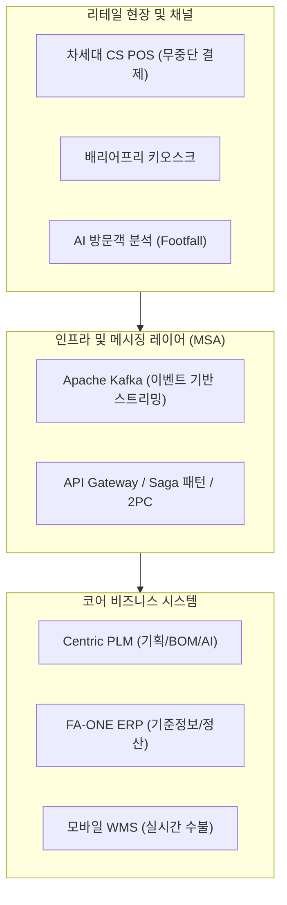

# 신성통상 FA-ONE 시스템 분석 및 개선 전략 보고서 요약

이 문서는 [원문 DOCX 텍스트](file:///C:/supersonic/llm_wiki/raw/sources/extracted/fa-one-73077b7a31_extracted.txt)를 기반으로 작성되었습니다. 본 보고서는 글로벌 패션 리더 신성통상의 패션관리 시스템 'FA-ONE'의 기술적·운영적 한계를 다차원적으로 진단하고, 클라우드 네이티브, AI 기반 PLM, 차세대 POS, 지능형 옴니채널 및 MSA 로드맵 등의 해소 방안을 **4단계 PI 프레임워크(As-Is, To-Be, Gap, 해결방안)**에 맞추어 도출한 종합 전략 보고서입니다.

---

## 🗺️ 차세대 FA-ONE 기술 & 비즈니스 아키텍처 맵

---

## 🔍 영역별 4단계 PI 진단 및 전환 전략

### 1. 인프라 및 소프트웨어 아키텍처

#### 📌 클라우드 자원 최적화 및 분산 처리
* **As-Is (현행)**: 모놀리식(Monolithic) 구조의 한계로 인해 이벤트 시 대규모 트래픽 폭주에 대처하지 못하고 병목 발생. 오토스케일링 부재로 인해 항상 높은 수준의 리소스를 유지하여 AWS 클라우드 운영 비용이 과도하게 낭비됨.
* **To-Be (목표)**: 대규모 트래픽 부하 분산 및 실시간 이벤트 스트리밍이 가능한 탄력적인 고가용성 인프라 구축.
* **Gap (격차)**: 동적 오토스케일링 제어 모듈 부재, 비동기 분산 메시지 큐 구조 결여.
* **RFP 해결방안**:
  - 기존 CentOS에서 AWS 최적화 운영체제인 **Amazon Linux 2**로 전면 전환.
  - **Apache Kafka**를 도입하여 결제/주문/재고 변경 이벤트를 비동기 스트리밍(Event-Driven Architecture) 처리.
  - **Amazon Aurora Cluster** 적용 및 실시간 트래픽 대응형 **Auto Scaling** 전면 기동.

#### 📌 마이크로서비스 아키텍처(MSA) 전환 로드맵
* **As-Is (현행)**: 서비스 간 결합도가 높아 특정 장애가 전사 시스템으로 확산되고, 신규 비즈니스 요구사항을 빠르게 코어 시스템에 배포하기 불가능함.
* **To-Be (목표)**: 주문, 결제, 상품, 재고 등의 핵심 도메인이 완벽히 분할되어 개별 배포 가능한 MSA 구조로 전환.
* **Gap (격차)**: 단일 데이터베이스(Single DB) 의존성 및 모놀리식 서비스 경계 모호.
* **RFP 해결방안**:
  - 도메인 주도 설계(DDD) 기반의 **서비스 경계 정의(Bounded Context)** 구축.
  - **Strangler Fig Pattern**을 적용하여 이커머스 등 가벼운 외부 채널 모듈부터 점진적으로 분리.
  - 분산 DB 간 데이터 무결성을 보장하기 위한 **Saga 패턴** 및 **2PC(Two-Phase Commit)** 기법 도입.

---

### 2. 상품기획 (PLM) 및 생산 관리

#### 📌 수작업 작지 및 이메일 기반 생산 협업
* **As-Is (현행)**: 디자인 작업지시서와 BOM(자재명세서)이 수작업 또는 엑셀, 메신저 등으로 파편적으로 전달되어 정보 불일치, 오기입으로 인한 불량률 상승, 제품 개발 리드타임(Lead Time) 증가를 초래함. 과거 데이터를 자산화하지 못해 직관에 의존해 기획함.
* **To-Be (목표)**: 전 유관 부서가 실시간으로 동일한 디자인/생산 데이터를 조회하고 디지털 결재를 수행하는 통합 워크플로우 확립.
* **Gap (격차)**: 디자인 및 개발 단계의 데이터 허브(PLM) 부재.
* **RFP 해결방안**:
  - **Centric PLM** 플랫폼 구축 및 Adobe Illustrator와의 실시간 데이터 다이렉트 연동.
  - AI 기반의 원단/부자재 정보 관리로 원가 예측 정확도 제고 및 과거 샘플 데이터의 DB 자산화.

---

### 3. 리테일 매장 시스템 (POS 및 키오스크)

#### 📌 웹 기반 POS의 성능 한계 및 통신 장애 취약성
* **As-Is (현행)**: 기존 POS가 웹 브라우저 기반으로 실행되어 단말기 메모리/CPU 제어로 렌더링이 지연되고, 결제 요청 집중 시 처리 지연 및 네트워크 일시 장애 시 오프라인 결제 중단 사고 발생.
* **To-Be (목표)**: 통신 장애 상황에서도 가용한 무중단 결제(Non-stop) 리테일 환경 구축.
* **Gap (격차)**: 하드웨어 리소스 다이렉트 바인딩 제어 엔진 및 로컬 캐시 결제 오프라인 처리 기능 부족.
* **RFP 해결방안**:
  - 기존 웹 브라우저 방식에서 **CS(Client-Server) 방식의 차세대 POS**로 전환하여 처리 속도 및 리소스 최적화 (CJ올리브네트웍스 협업).
  - 모바일 테더링 및 오프라인 로컬 결제를 연동하여 무중단 환경(Barrier-Free) 구현.
  - 매장 방문객 AI 정밀 분석(AI People Counter 및 RetailTrend 서비스)을 활용해 실시간 구매전환율 분석 탑재.

---

### 4. 물류 및 재고 연동

#### 📌 수동 배분 프로세스 및 채널별 재고 경합
* **As-Is (현행)**: 매장 물량 배분과 출고 결정이 수동으로 진행되어 리드타임 지연 및 품절(Stock-out)과 악성 재고가 동시에 존재함. 온-오프라인 채고 불일치로 온라인 주문에 대한 overselling 사고 빈번.
* **To-Be (목표)**: AI 배분 자동화 및 채널간 실시간 재고 가상 할당 관리 체계 구축.
* **Gap (격차)**: AI 기반 지능형 재고 분석 모델 및 논리적 가상 창고 엔진 부재.
* **RFP 해결방안**:
  - AI 물량 배분 최적화 솔루션을 도입하여 배분 전산화 처리 시간을 5분의 1로 감축.
  - 전용 모바일 WMS 앱을 통한 물류 실시간 데이터 처리.
  - 소프트웨어 기반 **'가상 창고(Virtual Warehouse)'** 개념을 구현하여 채널별 재고 버퍼 관리(Buffer Management) 및 실시간 판매가능 수량(OTS: Open to Sell) 자동 산출.

---

## 🔗 연계 지식 카드 (Obsidian Links)
* **상위 개념**: [[fone-as-is-analysis|FONE 현행 분석]], [[plm-fone-integration|PLM-FONE 연계]], [[wms-fone-inventory-integration|WMS-FONE 재고 연계]]
* **솔루션 분석**: [[centric-plm|센트릭 PLM]], [[wms|WMS 창고관리]]
* **회의록 및 다른 제안서**: [[fone-c348c1c5d9|FONE시스템분석및문제점공유]], [[20260318-3e3ced425c|차세대 패션관리시스템 개선 제안]]
