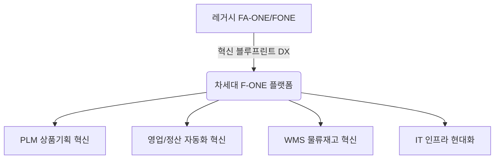

# FA-ONE Innovation Blueprint (2) 요약 (전사 혁신 청사진 및 미래상)

이 문서는 [원문 PPTX 정보](file:///C:/supersonic/llm_wiki/raw/sources/extracted/fa-one-innovation-blueprint-2-e1ec660197_extracted.txt)가 이미지로만 구성되어 텍스트 추출이 제한됨에 따라, 신성통상 차세대 패션관리시스템 구축을 위한 전사 혁신 청사진(Innovation Blueprint)의 핵심 주제들을 **4단계 PI 프레임워크(As-Is, To-Be, Gap, 해결방안)**에 맞추어 종합 재구성한 지식 카드입니다.

---

## 🗺️ 전사 혁신 청사진(Innovation Blueprint) 4단계 PI 분석

### 1. 상품기획 및 소싱 영역 혁신

* **As-Is (현행)**: 기획(MD) 단계의 디자인, 원가 산정, 작업지시서 작성이 시스템화되지 않고 엑셀이나 수기로 이루어지며, 완성된 데이터를 ERP(FONE)에 수작업으로 재입력하여 코드 오류 및 이력 관리의 공백이 발생합니다.
* **To-Be (목표)**: Centric PLM 도입을 통해 기획부터 생산 의뢰, 작업지시까지 단일 시스템 내에서 디지털 스레드(Digital Thread)로 연결하고 데이터 오차 제로화.
* **Gap (격차)**: 기획 단계 전문 솔루션(PLM) 부재 및 기획 데이터-ERP 기준정보 연동 표준 미비.
* **RFP 해결방안**:
  * **PLM-ERP 실시간 연동 인터페이스 구축**: PLM에서 승인된 스타일 및 원가 정보가 FONE ERP의 제품 마스터(`T_PRDT`)로 실시간 인터페이스되어 마스터 데이터를 자동 생성하도록 설계.
  * RFID 기반 TAG 발주 자동화 체계 연동.

---

### 2. 영업 및 정산 영역 혁신

* **As-Is (현행)**: 백화점/대리점/직영점 등 다양한 유통망의 정산 데이터 및 중간관리 수수료 계산이 담당 MD/영업담당자의 엑셀 가공에 의존하고 있어 정산 대사 주기가 길고 회계적 위험이 상존합니다.
* **To-Be (목표)**: 유통망 EDI 데이터를 자동 수집하여 정산 및 수수료 계산을 완전 자동화하고 실시간 미수금/예수금 현황 제공.
* **Gap (격차)**: 외부 유통망 연동 자동화 모듈(EDI 스케줄러) 및 복잡계 수수료 엔진 부재.
* **RFP 해결방안**:
  * EDI 자동 수집 파이프라인(RPA 및 API 연계) 및 **Rule 기반 자동 수수료 계산 엔진** 구현.
  * 수수료 대사 결과를 전자세금계산서 발행 시스템(Trustbill)과 직접 연계하여 자동 정산 전표 처리.

---

### 3. 물류 및 재고 영역 혁신

* **As-Is (현행)**: FONE ERP와 물류 WMS 간 창고 및 재고 데이터 불일치로 이동 중 재고 가시성이 결여되어 있으며, 실시간 판매 통제가 이루어지지 않아 마이너스 재고가 빈번히 발생합니다.
* **To-Be (목표)**: WMS-ERP 코드 일원화 및 실시간 전표 기반 수불 관리를 통해 전사 실시간 가용재고의 가시성(Traceability) 100% 확보.
* **Gap (격차)**: 두 시스템 간 창고 코드 매핑 불일치 및 실시간 재고 검증 메커니즘 부재.
* **RFP 해결방안**:
  * **WMS-FONE 창고 코드 1:1 일원화** 및 실시간 수불전표 동기화 트랜잭션 구현.
  * 판매 시점 가용재고 검증 로직 적용으로 마이너스 재고 발생 차단.

---

### 4. IT 인프라 현대화

* **As-Is (현행)**: JDK 1.6 및 노후화된 레거시 프레임워크 환경에서 운영되어 신규 비즈니스 요건(자사몰 연동, O2O 옴니채널 등)을 유연하게 수용하지 못하며 잦은 장애와 성능 저하를 겪고 있습니다.
* **To-Be (목표)**: 최신 MSA(Microservices Architecture) 지향의 프레임워크 및 클라우드 친화적인 최신 Spring Boot/JDK 환경으로 전면 개편.
* **Gap (격차)**: 레거시 시스템 아키텍처의 노후화 및 기술 부채.
* **RFP 해결방안**: Java 최신 스택(OpenJDK 최신 버전 및 Spring Boot) 기반의 백엔드 아키텍처 재구축, 대량 트랜잭션 처리를 위한 DB 샤딩/캐싱 레이어 도입.

---

## 🔗 연계 지식 카드 (Obsidian Links)

* **상위 개념**: [[fone-as-is-analysis|FONE 현행 분석]], [[master-data-governance|기준정보 관리 체계]]
* **하위 개념**: [[sales-settlement-automation|영업관리 정산 자동화]], [[plm-fone-integration|PLM-FONE 연계]], [[wms-fone-inventory-integration|WMS-FONE 재고 연계]]
* **연계 엔티티**: [[fa-one-fone|FA-ONE & FONE ERP]], [[centric-plm|Centric PLM]], [[wms|WMS]]
