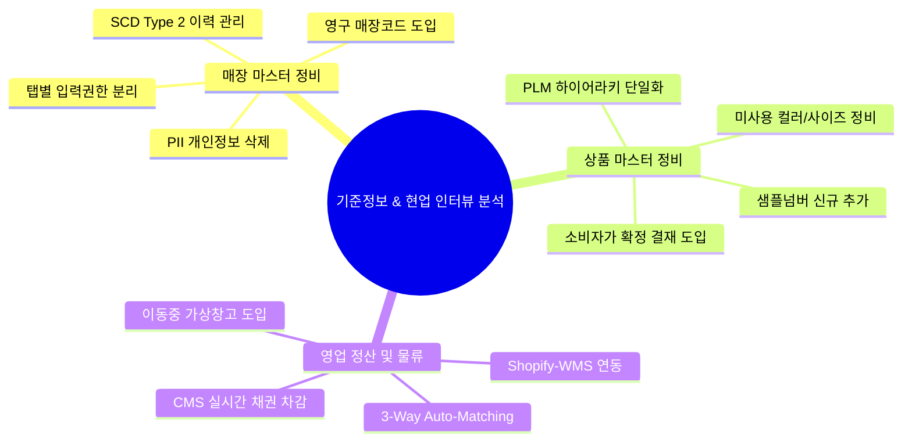

# 현업인터뷰 기준정보 분석 요약

이 문서는 `raw/sources/현업인터뷰자료` 및 `C:\supersonic\신성통상업무\IT부문\팀별자료\IT기획팀\1.IT기획팀\ASIS분석자료(FONE)\진행중\현업인터뷰` 폴더 내의 주요 자료(필드 정의 영역별 정리, 미스토홀딩스 GAP 분석, 영업관리 개선방안 보고 등)를 바탕으로, 현행 패션관리시스템의 데이터 필드 타당성 분석과 비즈니스 프로세스 개선 방향을 **4단계 PI 프레임워크(As-Is, To-Be, Gap, 해결방안)** 및 **상세 필드 정의**에 맞추어 종합 요약한 지식 카드입니다.

---

## 🧭 현업 인터뷰 및 GAP 분석 종합 4단계 PI

### 1. 현행 업무 보틀넥 및 문제점 (As-Is)
* **매장 마스터 관리 부실**: 매장 점주나 사업자가 변경될 때 매장코드를 수기 채번(오입력 위험)하고 신규 코드를 부여함으로써 과거 데이터와의 연속성이 단절됩니다. 또한, 담보설정이나 연락처 등 민감 정보가 수기로 변경되어 이력 관리가 불가합니다.
* **상품 기획-소싱 단절**: 상품 속성(카테고리/핏/라인)이 각 사업부마다 하드코딩 형태로 분산 관리되고, 칼라 코드는 1,434개 중 784개가 미사용인 채로 정합성이 유실되었습니다.
* **하이브리드 채널(Shopify/자사몰) 연동 단절**: 미스토홀딩스 및 자사몰 연동 시 실시간 프로모션/판가 동기화 지연으로 정산 오차가 발생하고, O2O 매출 발생 시 MD가 수기로 재고를 전입 처리하는 병목이 존재합니다.
* **이동 중 재고(Transit) 유실**: 점포 간 이동이나 반품 과정에서 '이동 중'인 재고의 관리 사각지대가 존재하여 재고 분실 시 책임 소재 파악이 불가능합니다.

### 2. 혁신적 지향점 (To-Be)
* **영구 점포 코드 및 실시간 이력 관리**: 사업자번호 변경과 무관하게 유지되는 물리적 거점 중심의 **'영구 매장코드'**를 도입하고, 점주/계약조건 변경은 타임스탬프 기반 이력(SCD Type 2)으로 자동 관리합니다.
* **PLM 기반 기획-소싱 단일 소스화**: 상품 분류 하이어라키를 단일화하고, 미사용 코드 정리 및 RFID 기반 자동 태그 발주 프로세스를 구축합니다.
* **영업 정산 및 대사 완전 자동화**: **3-Way Auto-Matching 엔진** 및 **RPA**를 가동하여 정산 리드타임을 90% 이상 단축하고, CMS 연동으로 미수채권을 실시간 상계 및 제어(Auto-Blocking)합니다.

### 3. 기술적/프로세스 격차 (Gap)
* **데이터 모델 유연성 및 메타데이터 결여**: 테이블의 가변 속성 필드가 부족하여 범용 `ATTR` 컬럼을 남용하고 있으며, 필드별 비즈니스 소유권과 R&R이 모호합니다.
* **실시간 인터페이스 및 대사 모듈 부재**: 시스템 간(Shopify-GERP-WMS-VAN) 실시간 가격/프로모션 I/F 규격이 불일치하며, '이동 중 재고'를 트래킹할 수 있는 가상 Transit 창고 수불 개념이 전무합니다.

### 4. 차세대 시스템 요건 (RFP 해결방안)
* **부서별 권한 탭(Tab) 분리**: 매장 기본은 영업관리, 상세는 영업, 금융/담보는 총무팀 권한으로 격리하여 Workflow 승인 프로세스 연동.
* **3-Way 대조 및 예외 대시보드 구축**: ERP 매출-유통망 정산액-VAN 실입금액 간 자동 매칭 로직 탑재.
* **Transit Warehouse(이동중 가상창고) 수불 엔진 도입**: RT 및 반품 시 재고 소유권을 임시 귀속시켜 분실 추적성 100% 확보.
* **실시간 채권 상계 및 자동 판매 차단(Auto-Blocking)**: CMS 입금 즉시 미수를 차감하고, 연체 임계치 초과 시 POS/자사몰 주문 자동 블로킹.

---

## 📊 매장 기준정보 필드 정의서 (104개 필드 분석)

| 필드명 | 정의 | 섹션 | 판정 | 주요 의견 및 영향도 분석 |
| :--- | :--- | :--- | :--- | :--- |
| **매장ID** | 시스템 내 매장 고유 식별 코드 | 기본 매장 식별 | ✅ 유지 필수 | POS, AIS, 물류, 자사몰, BI 등 전사 시스템의 기준 키 (변경 불가) |
| **매장명** | 매장의 공식 명칭 (대외 노출용) | 기본 매장 식별 | ✅ 유지 필수 | 영수증, 굿웨어몰 매장찾기, 백화점 EDI, 세금계산서 노출 필드 |
| **매장전화번호** | 매장 대표 연락처 | 기본 매장 식별 | ✅ 유지 필수 | CS 응대, 자사몰 매장정보, 외부 지도 API 연동 |
| **매장주소** | 매장의 물리적 소재지 도로명/지번 | 기본 매장 식별 | ✅ 유지 필수 | 물류 배송 라우팅, 지도 API, 세금계산서 발행 시 사용 |
| **개업일자** | 매장 영업 개시일 | 운영 기간 정보 | ✅ 유지 필수 | 매장 생애주기 분석, 점간이동 제한 기준일, P/L 산정 |
| **영업종료일** | 매장 폐점 예정/실제 일자 | 운영 기간 정보 | ✅ 유지 필수 | 폐점 매장 마감 처리, 재고 회수, POS/자사몰 노출 차단 트리거 |
| **폐점구분** | 매장의 폐점 상태 유형 구분 | 매장 유형/운영 | ✅ 유지 필수 | 매출/재고/정산 마감 필터링 및 자사몰 노출 제어 기준 |
| **유통망대분류** | 유통 경로 최상위 구분 (백화점/대리점 등) | 매장 유형/운영 | ✅ 유지 필수 | 정산 마감, 매출 집계, 매장 배분, BI 분석의 핵심 그룹핑 키 |
| **유통망중분류** | 유통 경로 중간 단계 분류 | 매장 유형/운영 | ✅ 유지 필수 | 정산 및 매출 분석, 매장 배분 등급 설계 시 세부 구분자 |
| **유통망소분류** | 유통 경로 최하위 세부 분류 | 매장 유형/운영 | ✅ 유지 필수 | 정산 및 매출 분석, 매장 배분 등급 설계 시 세부 구분자 |
| **매장유형** | 직영/위탁/대리점/아울렛 등 운영 구분 | 매장 유형/운영 | ✅ 유지 필수 | 매출 인식 기준, 정산 수수료 로직, 재고 소유권 판단 분기 |
| **운영형태** | 상시/팝업/할인/특판 등 운영 방식 | 매장 유형/운영 | ✅ 유지 필수 | 판매 분석 및 행사 매장 식별, 자사몰 노출 분기 |
| **닷컴운영** | 온라인 자사몰 연동 운영 여부 | 매장 유형/운영 | ✅ 유지 필수 | 자사몰 옴니채널 재고 노출 및 매장 픽업 가용성 판단 키 |
| **통합매장ID** | 다채널 통합 매장 식별 코드 | 기본 매장 식별 | ⚠ 의견 상충 | 옴니채널 매출 합산 및 통합 BI 리포팅 활용 (영업팀 요청) |
| **단말기번호** | POS 또는 결제 단말기 고유 번호 | 기본 매장 식별 | ⚠ 의견 상충 | POS-VAN 연동 실시간 판매펀칭 및 정산 마감 매칭 키 |
| **매장약칭명** | 영수증/라벨용 축약 매장명 | 기본 매장 식별 | ⚠ 의견 상충 | 글자수 제한 대응용이나, 명칭 표준화하여 매장명 단일화 권장 |
| **단말기구분** | 결제 단말기 종류 코드 | 기본 매장 식별 | ⚠ 의견 상충 | VAN/PG사 라우팅 및 정산 매칭, 단말기 호환 분기 |
| **과세사업장유무**| 부가가치세 과세 대상 여부 | 기본 매장 식별 | ⚠ 의견 상충 | AIS 회계 전표 발행 시 신고사업장 자동 매핑에 필수적 |
| **탑텐매장구분** | 탑텐 전용 매장 등급 분류 | 기본 매장 식별 | ⚠ 의견 상충 | P/L 대시보드 및 영업 관리 기준. R&R을 영업팀으로 변경요청함 |
| **우편번호** | 매장 우편번호 | 기본 매장 식별 | ⚠ 의견 상충 | 굿웨어몰 및 자사몰 매장 정보, 배송 API 연동에 필요 |
| **매장주소상세** | 매장의 층, 호수 등 상세 주소 | 기본 매장 식별 | ⚠ 의견 상충 | 고객 응대 및 배송 정확도, 자사몰 노출 (R&R 영업팀 이관 요청) |
| **운영층수** | 매장 운영 층수 | 기본 매장 식별 | ⚠ 의견 상충 | 매장찾기 노출 및 기초정보 대시보드 구성요소 |
| **KICC단말기** | KICC VAN사 단말기 사용 여부 | 매장 분류/상태 | ⚠ 의견 상충 | VAN사 결제 승인 분기 및 정산 마감 매칭 |
| **환급단말기번호**| 외국인 부가세 즉시환급 단말기 번호 | 매장 분류/상태 | ⚠ 의견 상충 | 관세청 환급 연동 및 판매등록 시 자동 환급액 산정 |
| **토스단말기여부**| 토스페이먼츠 단말기 여부 | 매장 분류/상태 | ⚠ 의견 상충 | 토스페이 결제 승인 및 수수료 정산 매칭용 |
| **영업구분** | 매장 영업관리 부서/담당 구분 | 매장 분류/상태 | ⚠ 의견 상충 | 담당자별 판매 분석 구분자 (퇴사자 정리 및 주기적 업데이트 필요) |
| **거점매장여부** | 권역 내 허브(거점) 점포 여부 | 매장 분류/상태 | ⚠ 의견 상충 | 점간이동(RT) 자동 배분 로직 가중치 및 중간관리자 수수료 산정 |
| **과세여부** | 과세/면세 사업 구분 플래그 | 매장 분류/상태 | ⚠ 의견 상충 | 해외/국내 재매입 프로세스 부가세 처리 분기 |
| **사업자번호** | 사업자등록번호 (10자리) | 매장 분류/상태 | ⚠ 의견 상충 | 세금계산서 발행 및 AIS 회계 전표 연동의 핵심 조인 키 |
| **종사장번호** | 종된 사업장 번호 | 매장 분류/상태 | ⚠ 의견 상충 | 지점별 세금 신고 및 다사업장 정산 처리 |
| **대표자명** | 매장 사업자 대표 성명 | 매장 분류/상태 | ⚠ 의견 상충 | 법적 문서 및 정산 대사, 세금계산서 발행 용도 |
| **현금영수증여부**| 현금영수증 자진발급 대상 여부 | 운영 기간 정보 | ⚠ 의견 상충 | 국세청 자진발급 연동 API 및 POS 결제 처리 분기 |
| **즉시환급여부** | 외국인 즉시환급 가능 플래그 | 운영 기간 정보 | ⚠ 의견 상충 | 면세 판매 거래 및 POS 즉시환급 검증 트리거 |
| **영수증출력여부**| 매장용 영수증 출력 제어 여부 | 운영 기간 정보 | ⚠ 의견 상충 | 영수증 인쇄 롤지 절약 및 거래 증빙 보관 정책 제어 |
| **상품권회수여부**| 상품권 결제 및 회수 처리 가능 여부 | 운영 기간 정보 | ⚠ 의견 상충 | 상품권 정산 대사 및 마케팅 프로모션 매장 선정 시 필터링 |
| **담보금액** | 보증금/담보 설정액 | 운영 기간 정보 | ⚠ 의견 상충 | 리스크 관리용. 입력 R&R을 영업팀에서 총무팀으로 이관 요청 |
| **부동산담보** | 부동산 담보 설정액 및 정보 | 운영 기간 정보 | ⚠ 의견 상충 | 대리점 계약 체결 및 리스크 관리용 (R&R 총무팀 이관 요청) |
| **운영시간** | 매장 영업 시간 | 운영 기간 정보 | ⚠ 의견 상충 | 자사몰 매장찾기, 고객 안내용 연동 필드 |
| **주차가능여부** | 주차 지원 여부 | 운영 기간 정보 | ⚠ 의견 상충 | 자사몰 매장찾기, 고객 안내용 연동 필드 |
| **현금담보** | 현금성 담보액 | 매장 유형/운영 | ⚠ 의견 상충 | 대리점 미수금 리스크 제어 및 P/L 대시보드 연계 (총무팀 권한) |
| **점간제외여부** | RT(점간이동) 요청 제외 여부 | 매장 유형/운영 | ⚠ 의견 상충 | 점간이동 자동 배분 엔진의 제외 필터링으로 직접 작동 |
| **실DP가능평수** | 실제 진열 가능 매장 평수 | 매장 유형/운영 | ⚠ 의견 상충 | 초도 배분 물량 가중치 산정 및 P/L 대시보드 반영 |
| **기타담보** | 기타 담보(보증증권 등) 설정액 | 매장 유형/운영 | ⚠ 의견 상충 | 대리점 채권 한도 상계용 (R&R 총무팀 이관) |
| **보험** | 화재/도난 등 매장 가입 보험 정보 | 매장 유형/운영 | ⚠ 의견 상충 | 매장 리스크 및 자산 보존 관리용 (R&R 총무팀 이관) |
| **수기판매반품제한**| POS 수기 판매 및 반품 제한 플래그 | 매장 유형/운영 | ⚠ 의견 상충 | 부정 거래 및 무분별한 반품 방지를 위한 POS 제어 로직 작동 |
| **창고평수** | 매장 부속 창고 면적 (평) | 매장 유형/운영 | ⚠ 의견 상충 | 매장 적정재고 한도(CAPA) 산정 및 초도 배분 등급 맵핑 |
| **불러오기제한** | POS 영수증 불러오기 횟수 제한 | 매장 유형/운영 | ⚠ 의견 상충 | 영수증 중복/부정 사용 방지를 위한 POS 트랜잭션 제어 |
| **교환반품제한** | 교환/반품 가능 기간(일) 제한 | 매장 유형/운영 | ⚠ 의견 상충 | 영수증 반품 기한 초과 시 POS 단에서 수기 차단 처리 |
| **유통계열사** | 소속 유통사 (신세계, 롯데 등) | 매장 유형/운영 | ⚠ 의견 상충 | 백화점 정산, 마진율별 정산 대사 화면에서 구분자로 활용 |
| **유통계열지점** | 소속 유통사 세부 지점명 | 매장 유형/운영 | ⚠ 의견 상충 | 백화점 정산 및 유통망 매출 연동용 |
| **회계 유통망** | 회계 감사용 유통 구분 코드 | 매장 유형/운영 | ⚠ 의견 상충 | **재무팀 필수 필드**. 월 마감 전표 분류 및 외부 회계감사 대응 |
| **국가코드** | 매장 국가 코드 | 매장 유형/운영 | ⚠ 의견 상충 | 글로벌 확장성 대비용. 현재 국내 정산에서는 미사용 상태 |
| **지역코드** | 매장 지역 코드 (시/도 구분) | 매장 유형/운영 | ⚠ 의견 상충 | 권역별 영업 분석 및 BI 대시보드 집계용 (정산 미사용) |
| **매장등급구분** | 매장 등급 (S/A/B/C 등) | 물류/배분 설정 | ⚠ 의견 상충 | 현업에서 별도 엑셀로 수기 관리하여 시스템 데이터와 이격됨 |
| **배분등급구분** | 상품 자동 배분 가중치 등급 | 물류/배분 설정 | ⚠ 의견 상충 | 배분 엔진의 신상품 초도 할당량 계산용 |
| **재고관리구분** | 매장 재고 관리 방식 | 물류/배분 설정 | ⚠ 의견 상충 | 자동 재고 보충(VMI) 및 수동 관리 분기 필터 |
| **저가여부** | 상설/아울렛 저가 매장 여부 | 물류/배분 설정 | ⚠ 핏/단가 분기 | 아울렛 특화 단가 정책 및 이월 재고 배분용 |
| **재매입여부** | 재매입(반품매입) 거래 가능 여부 | 물류/배분 설정 | ⚠ 의견 상충 | 제품 공급가 조정 및 재매입 정산 전표(AIS) 자동 생성 |
| **수시출고반품여부**| 상시 출고 및 반품 가능 여부 | 물류/배분 설정 | ⚠ 의견 상충 | 물류/배분 시스템의 출고/반품 전표 생성 통제 키 |
| **재매입수행구분**| 재매입 처리 방식 코드 | 물류/배분 설정 | ⚠ 의견 상충 | 재매입 계산 로직 분기 및 월말 회계 대사 키 |
| **직원판매여부** | 임직원 사복 판매 허용 여부 | 물류/배분 설정 | ⚠ 의견 상충 | POS 임직원 할인가 자동 적용 및 한도 검증 연동 |
| **배분제외여부** | 자동 배분 제외 여부 플래그 | 물류/배분 설정 | ⚠ 의견 상충 | 신상품 초도 배분 엔진의 강제 스킵 필터 |
| **연체이자부과여부**| 대리점 대금 지연 시 이자 청구 여부 | 물류/배분 설정 | ⚠ 의견 상충 | 대리점 정산 마감 및 채권 미수 이자 자동 계산 |
| **수선비부과여부** | 대리점 고객 수선비 부과 여부 | 물류/배분 설정 | ⚠ 의견 상충 | 매장 수선 실적 정산 시 대리점 공제 전표 자동 매핑 |
| **재고조회여부** | 타 매장/자사몰 재고 조회 허용 여부 | 물류/배분 설정 | ⚠ 의견 상충 | 자사몰 재고 연동 및 POS 점간 재고 조회 권한 통제 |
| **판매정지여부** | 매장 판매 기능 정지 플래그 | 물류/배분 설정 | ⚠ 의견 상충 | POS 판매 등록 차단 및 자사몰 노출 강제 비활성화 |
| **출고통제대상여부**| 물류센터 출고 차단 대상 여부 | 물류/배분 설정 | ⚠ 의견 상충 | 물류/WMS 배송 요청 승인 차단 및 자동 배분 강제 스킵 |
| **행낭코드** | 행낭 발송 구분 코드 | 물류/배분 설정 | ⚠ 의견 상충 | 본사-매장 간 물류 행낭 발송 라우팅용 |
| **출고정지여부** | 물류센터 출고 정지 플래그 | 물류/배분 설정 | ⚠ 의견 상충 | WMS 출고 의뢰 차단 및 배송 지시 자동 스킵 |
| **점간제한일수** | 신규 매장의 점간 이동 제한 일수 | 물류/배분 설정 | ⚠ 의견 상충 | 신규 매장 재고 안정화를 위한 RT 지시 통제 검증 |
| **계약구분** | 매장 계약 형태 (임대/위탁 등) | 판매/정산 설정 | ⚠ 의견 상충 | 백화점 정산 및 대리점 마진별 수수료 정산 계산식 분기 |
| **계산서발행구분**| 세금계산서 발행 주체 구분 | 판매/정산 설정 | ⚠ 의견 상충 | 백화점 정산 화면 및 국세청 계산서 자동 발행 전송 키 |
| **계산서발행방법**| 정발행, 역발행 등 발행 방식 | 판매/정산 설정 | ⚠ 의견 상충 | Trustbill API 연동 시 전자세금계산서 연동 로직 분기 |
| **EDI사용여부** | 백화점 등 외부 EDI 연동 여부 | 판매/정산 설정 | ⚠ 의견 상충 | 백화점 정산 및 매출 자동 수집(RPA) 연동의 트리거 |
| **대금결제일** | 정산 대금 청구/지급일 | 판매/정산 설정 | ⚠ 의견 상충 | AIS 자금 계획 연동 및 대리점 정산 월 마감 프로세스 |
| **실대표자성명** | 점장 또는 중간관리자 성명 | 실대표자/임대인 | ⚠ 의견 상충 | 중간관리자 수수료 정산 및 매장 매니저 인사 정보와 혼선 |
| **실대표자자택전화**| 점장/중간관리자 연락처 | 실대표자/임대인 | ⚠ 의견 상충 | 비상 연락용. 용어를 '자택전화'에서 '휴대폰번호'로 변경 필요 |
| **임대인성명** | 건물 임대인 성명 | 실대표자/임대인 | ⚠ 의견 상충 | 임대료 지급 관리 및 P/L 대시보드 임차료 항목 산정 |
| **임대인사업자번호**| 임대인의 사업자번호 | 실대표자/임대인 | ⚠ 의견 상충 | 임대료 매입세금계산서 수취 및 AIS 매입 전표 연동 |
| **임대인전화번호**| 임대인 연락처 | 실대표자/임대인 | ⚠ 의견 상충 | 임대차 계약 관리 및 총무팀 임차 관리용 |
| **임대인지급일** | 임대료 지급 처리일 | 실대표자/임대인 | ⚠ 의견 상충 | AIS 자금 집행 스케줄러 및 P/L 대시보드 반영 |
| **자사몰DP여부** | 온라인몰 매장 노출 여부 | 자사몰 설정 | ⚠ 의견 상충 | 자사몰 매장찾기 노출 여부 제어 (현재 시스템상 미사용) |
| **브랜드** | 매장의 취급 브랜드 코드 | 기본 매장 식별 | ⚙ 자동입력 | 브랜드별 매출/재고 통계 및 정산 마감 분기 (시스템 자동입력) |
| **GPS주소등록** | 매장 위경도 좌표 데이터 | 기본 매장 식별 | ⚙ 자동입력 | 근태 관리 및 지도 API 연동, 자사몰 픽업 거리 계산용 |
| **매장담당자** | 매장 담당 브랜드 영업담당 사번 | 매장 분류/상태 | ⚙ 자동입력 | 영업 실적 평가, 인사 조직 매핑 연동 |
| **환급매장코드** | 사후면세 환급용 매장 식별자 | 매장 분류/상태 | ❌ 삭제 검토 | 관세청 즉시환급 연동으로 대체 가능하여 불필요 |
| **고객분석여부** | CRM 데이터 수집 여부 플래그 | 매장 분류/상태 | ❌ 삭제 검토 | CRM 시스템 통합에 따라 개별 ERP 마스터에서 관리 불필요 |
| **종업원수** | 매장 근무 직원 수 | 매장 분류/상태 | ❌ 삭제 검토 | ERP 기준정보 대신 모바일 근태/인사 관리 시스템으로 이관 |
| **POS수** | 매장 내 설치 POS 단말기 수 | 매장 분류/상태 | ❌ 삭제 검토 | 단말기 마스터 테이블 조회로 동적 산출 가능하여 마스터 삭제 |
| **채널ID** | 외부 판매 채널 식별자 | 매장 분류/상태 | ❌ 삭제 검토 | 현재 시스템 내에서 전혀 사용되지 않는 미사용 필드 |
| **온라인프로모션**| 온라인 프로모션 적용 여부 | 운영 기간 정보 | ❌ 삭제 검토 | 자사몰 프로모션 엔진으로 이관하여 ERP 단독 관리 배제 |
| **검수구분** | 입고 검수 방식 분류 | 물류/배분 설정 | ❌ 삭제 검토 | 물류 WMS 검수 표준화로 인해 ERP 내 개별 필드 불필요 |
| **에누리여부** | 마크다운/할인 에누리 가능 플래그 | 물류/배분 설정 | ❌ 삭제 검토 | POS 표준 할인 정책으로 통합 관리하여 개별 플래그 무의미 |
| **사입재고관리** | 사입재고 전용 관리 플래그 | 물류/배분 설정 | ❌ 삭제 검토 | 사입재고가 실제 발생하지 않아 스키마에서 정비/삭제 |
| **행사여부** | 프로모션 매장 여부 플래그 | 물류/배분 설정 | ❌ 삭제 검토 | 자사몰/영업 프로모션 테이블로 관리 일원화 |
| **출고작업그룹** | 물류 출고 작업 매핑용 그룹 코드 | 물류/배분 설정 | ❌ 삭제 검토 | WMS 출고 배치 및 라우팅 로직으로 통합 처리 |
| **배송업체구분** | 물류 배송 지정 택배사 코드 | 물류/배분 설정 | ❌ 삭제 검토 | WMS 배송 정보 연동으로 처리하여 ERP 내 관리 불필요 |
| **적요** | 매장 관련 일반 텍스트 메모 | 판매/정산 설정 | ❌ 삭제 검토 | 데이터 표준에 부적합한 비정형 텍스트 필드로 삭제 |
| **실대표자주민번호**| 실대표자 주민등록번호 | 실대표자/임대인 | ❌ 삭제 검토 | **개인정보보호법(PII) 위반 위험**. 반드시 삭제하고 생년월일로 대체 |
| **실대표자우편번호**| 실대표자 자택 우편번호 | 실대표자/임대인 | ❌ 삭제 검토 | 개인 주소 불필요. 매장 주소로 충분히 갈음 가능 |
| **실대표자주소** | 실대표자 자택 주소 | 실대표자/임대인 | ❌ 삭제 검토 | 개인 주소 불필요. 매장 주소로 충분히 갈음 가능 |
| **실대표자주소상세**| 실대표자 자택 상세 주소 | 실대표자/임대인 | ❌ 삭제 검토 | 개인 주소 불필요. 매장 주소로 충분히 갈음 가능 |
| **매장수령가능여부**| 자사몰 주문 매장 수령 플래그 | 자사몰 설정 | ❌ 삭제 검토 | 닷컴운용(`DOTCOM_YN`) 필드로 통합 및 자사몰 시스템 처리 |
| **유료수선가능여부**| 유료 AS 수선 서비스 제공 여부 | 자사몰 설정 | ❌ 삭제 검토 | AS 시스템 마스터 또는 자사몰 매장 안내 속성으로 이관 |

---

## 📊 상품 기준정보 필드 정의서 (71개 필드 분석)

| 필드명 | 정의 | 섹션 | 판정 | 주요 의견 및 영향도 분석 |
| :--- | :--- | :--- | :--- | :--- |
| **제품코드** | 상품 고유 식별 코드 (품번) | 작업지시 기본 | ✅ 유지 필수 | POS, 물류, 자사몰, BI, 소싱 등 전 시스템의 메인 키 |
| **제품명** | 상품 공식 명칭 | 작업지시 기본 | ✅ 유지 필수 | 가격택 인쇄, 자사몰, 포스 영수증에 직접 노출되는 기준명 |
| **한글제품명** | 온라인 자사몰 노출용 한글 상품명 | 작업지시 기본 | ✅ 유지 필수 | 자사몰 및 네이버쇼핑 등 외부 연동 채널 송출 상품명 |
| **어패럴타입** | 의류 유형 구분 (상의, 하의 등) | 작업지시 기본 | ✅ 유지 필수 | 사이즈 SPEC 및 패턴실 작업 분기, 카테고리 매핑의 기준 |
| **카테고리** | 상품 카테고리 분류 체계 | 작업지시 기본 | ✅ 유지 필수 | 자사몰 카테고리 트리, BI 수익성/매출 집계의 기초 |
| **Repeat생성** | 동일 품번 리오더 생산 여부 | 작업지시 기본 | ✅ 유지 필수 | 생산 자동화, 협력업체 추가 발주서 연동의 트리거 |
| **MD사번** | 상품 기획 담당 MD 사번 | 작업지시 기본 | ✅ 유지 필수 | 담당자별 영업 실적 추적, 인사 동기화, 권한 관리 |
| **디자이너사번** | 상품 디자인 담당자 사번 | 작업지시 기본 | ✅ 유지 필수 | 디자인실 실적, 작업지시서 PDF 출력 연동 |
| **납기요청일자** | 협력사 물류 입고 예정 납기일 | 생산 일정/수량 | ✅ 유지 필수 | 수입/통관, WMS 입고 예정 정보, 협력업체 포털 연동 키 |
| **납기변경사유** | 납기일 변경 시 사유 입력 | 생산 일정/수량 | ✅ 유지 필수 | 소싱팀의 납기 준수율(KPI) 산정 및 협력사 평가 데이터 |
| **목표원가** | 최초 기획 단계의 목표 원가 | 생산 일정/수량 | ✅ 유지 필수 | 제조 마진 계산, 가격 책정, BI 이익 분석의 기초값 |
| **소비자가** | 상품의 정식 소비자 판매가 | 생산 일정/수량 | ✅ 유지 필수 | 가격택 바코드 생성, POS 결제, 자사몰 판매 가격의 원천 |
| **소비자가확정** | 소비자가 책정 상태 (승인/미승인) | 생산 일정/수량 | ✅ 유지 필수 | 확정 시 가격택 발주 트리거 작동 및 자사몰 노출 허용 |
| **Packing Type** | 상품 포장 유형 (Solid/Assort 등) | 생산 일정/수량 | ✅ 유지 필수 | WMS 입고 검수 기준, 협력업체 패킹 리스트(DPL) 연동 |
| **원단SPEC** | 원단 사양 정보 (번수, 조직) | 원단/소재 정보 | ✅ 유지 필수 | 작업지시서, 협력업체 생산 사양서, 소재팀 원단 발주 |
| **혼용률** | 원단 소재 구성비 (예: 면 100%) | 원단/소재 정보 | ✅ 유지 필수 | KATS 품질라벨 인쇄, 자사몰 상세정보 필수 고시 항목 |
| **신축성** | 원단 신축성 등급 | 원단/소재 정보 | ✅ 유지 필수 | 자사몰 상품 상세 가이드, 작업지시서 스펙 매핑 |
| **비침** | 원단 비침 정도 등급 | 원단/소재 정보 | ✅ 유지 필수 | 자사몰 상품 상세 가이드, 고객 응대용 정보 |
| **안감** | 안감 적용 여부 및 사양 | 원단/소재 정보 | ✅ 유지 필수 | 작업지시서 및 협력업체 사양서 연동 |
| **온라인카테고리대**| 자사몰 카테고리 대분류 | 온라인 카테고리| ✅ 유지 필수 | 자사몰 네비게이션(GNB) 노출, 외부 마켓 매핑 |
| **온라인카테고리중**| 자사몰 카테고리 중분류 | 온라인 카테고리| ✅ 유지 필수 | 자사몰 메인 LNB 노출 및 카테고리 필터 |
| **온라인카테고리소**| 자사몰 카테고리 소분류 | 온라인 카테고리| ✅ 유지 필수 | 자사몰 검색 필터링용 카테고리 노출 |
| **온라인카테고리세**| 자사몰 카테고리 세분류 | 온라인 카테고리| ✅ 유지 필수 | 자사몰 지능형 상품 추천 알고리즘의 학습 메타 데이터 |
| **기획사이즈** | 상품 기획 단계 사이즈 세트 (S/M/L) | 기획사이즈 탭 | ✅ 유지 필수 | 작업지시서 출력, POS 옵션, 자사몰 옵션 자동 생성 |
| **칼라코드** | 컬러 식별 코드 | 기획사이즈 탭 | ✅ 유지 필수 | SKU 생성의 핵심, POS/자사몰 옵션 키로 작동 |
| **사이즈별수량** | 사이즈별 기획/발주량 | 기획사이즈 탭 | ✅ 유지 필수 | 발주서 생성, 물류 입고 계획, 매장 자동 배분량 배정 |
| **사용부위** | SPEC 측정용 부위 (가슴둘레 등) | Size/Spec 탭 | ✅ 유지 필수 | 작업지시서 치수 시트 구성, 패턴실 작업, 자사몰 조견표 |
| **사이즈별치수** | 사용부위별 상세 단면 스펙 치수 | Size/Spec 탭 | ✅ 유지 필수 | 작업지시서 스펙 시트, 자사몰 사이즈표, QC 검사 기준 |
| **지시서출력** | 작업지시서 PDF 인쇄 여부 플래그 | Style/Sketch 탭| ✅ 유지 필수 | 협력업체 전달용 작업지시서 자동 PDF 생성 로직 작동 |
| **상세출력** | 세부 스펙 인쇄 여부 플래그 | Style/Sketch 탭| ✅ 유지 필수 | 협력업체 전달용 작업지시서 상세 페이지 인쇄 로직 연동 |
| **분할차수** | 물류 입고 분할 차수 (1차/2차 등) | 분할입고 탭 | ✅ 유지 필수 | 물류 입고 일정 계획, 협력사 분할 선적 관리 |
| **수량** | 분할 입고별 예정 수량 | 분할입고 탭 | ✅ 유지 필수 | WMS 입고예정정보 및 매장 초도배분 계획 연동 |
| **분할입고요청일**| 분할 입고 예정일자 | 분할입고 탭 | ✅ 유지 필수 | 물류 창고 CAPA 계획, 자사몰 입고 예정일 노출 |
| **SKU별수량** | 컬러별/사이즈별 세부 수량 | 분할입고 탭 | ✅ 유지 필수 | 입고 검수 및 매장 배분의 최소 단위 데이터(SKU) |
| **영문제품명** | 상품 영문 표기명 | 작업지시 기본 | ⚠ 의견 상충 | 올젠 미사용. 국문명 입력 시 표준 사전 기반 자동 영문 변환 요청 |
| **소재타입** | 니트/우븐 등 소재 구분 코드 | 작업지시 기본 | ⚠ 의견 상충 | 올젠 미사용. 팬츠/스커트 카테고리 분리 시 필수적 (BI 분석용) |
| **제품유형구분** | 상품 유형 구분 코드 | 작업지시 기본 | ⚠ 기존 사용 X | 과거 레거시 스키마. 현재 사용하지 않아 신규 아키텍처에서 정비 |
| **컬러타입** | 단색/패턴 등 컬러 유형 구분 | 작업지시 기본 | ⚠ 의견 상충 | 올젠 미사용. 기획-생산 연동 부재로 수동 입력만 처리되어 정합성 낮음 |
| **원산지구분** | 생산 국가 원산지 구분 (KC/CN/VN 등) | 작업지시 기본 | ⚠ 의견 상충 | 택/품질라벨 의무 표기용. 작업지시서 발행 시 수기 변경 차단 필요 |
| **프로그램** | 기획 프로그램(라인) 구분 코드 | 작업지시 기본 | ⚠ 의견 상충 | BI 분석에 활용되나, 사업부 실상과 맞지 않아 하이어라키 정비 필요 |
| **핏** | 핏 정보 (슬림/오버/레귤러 등) | 작업지시 기본 | ⚠ 의견 상충 | 자사몰 검색 필터의 핵심. 최신 핏 데이터로 마스터 표준화 필요 |
| **소싱담당사번** | 소싱 담당자 사번 | 작업지시 기본 | ⚠ 의견 상충 | 최근 생성 탭. 소싱 실적 평가 및 협력사 관리에 활용 |
| **수입여부** | 해외 생산/수입 여부 플래그 | 생산 일정/수량 | ⚠ 의견 상충 | 올젠 미사용. 수입 통관 및 AIS 관세/원가 배분 전표 분기 키 |
| **유통사업구분** | 자체/라이센스/유통사입 등 구분 | 생산 일정/수량 | ⚠ 의견 상충 | 라이센스 마진 정산, 매출 인식 기준, BI 사업 분석 |
| **납기변경상세** | 납기 지연 상세 사유 기입 | 생산 일정/수량 | ⚠ 의견 상충 | 올젠 미사용. 소싱팀 납기준수율용이나 입력 후 조회 불가 상태 |
| **Budget형태** | 버짓 관리 유형 구분 | 생산 일정/수량 | ⚠ 의견 상충 | 올젠 미사용. 버짓 변경이 너무 잦아 시스템 추적 어려움 (개선 필요) |
| **런칭일자** | 매장 출시 예정일 | 생산 일정/수량 | ⚠ 의견 상충 | 납기일자 + 7일 자동 계산 로직 적용 (수기 변경 가능) |
| **발주구분** | 정상/리오더/특발 등 발주 유형 | 생산 일정/수량 | ⚠ 의견 상충 | 협력사 발주서 분기용이나 현황 추적 안 되어 활용도 매우 낮음 |
| **목표생산원가** | 목표 생산배수/원가 | 생산 일정/수량 | ⚠ 의견 상충 | 명칭 혼선 존재 (원가 vs 배수). 마진/수익 분석 위해 용어 정립 필요 |
| **소비자가확정일**| 소비자가 확정 및 승인 일자 | 생산 일정/수량 | ⚠ 의견 상충 | 태그 발행 및 오기 방지용 크로스체크 일자로 활용 |
| **분할입고여부** | 분할 입고 설정 플래그 | 생산 일정/수량 | ⚠ 의견 상충 | 물류 입고 예정 및 자사몰 노출 스케줄링 연동의 온/오프 스위치 |
| **FDS번호** | Fabric Data Sheet 번호 | 원단/소재 정보 | ⚠ 의견 상충 | 올젠 미사용. 소재팀 원단 발주 및 사양서 관리 키 |
| **원단소재** | 원단 구성 종류 명칭 | 원단/소재 정보 | ⚠ 의견 상충 | 올젠 미사용. 품질라벨 인쇄 및 자사몰 소재 필터 연동용 |
| **칼라명** | 컬러 한글 명칭 | 기획사이즈 탭 | ⚠ 의견 상충 | 영수증 및 자사몰 옵션 표기명 (칼라코드 기반 자동 생성) |
| **대표칼라** | 대표 이미지 노출용 컬러 플래그 | 기획사이즈 탭 | ⚠ 의견 상충 | 자사몰 썸네일 이미지 로딩 및 온라인 마케팅 노출 우선순위 |
| **합계수량** | SKU별 기획 수량 합계 | 기획사이즈 탭 | ⚠ 의견 상충 | 발주/수입신고서의 검증값으로 시스템 자동 연산 처리 |
| **사용부위(영)** | 사용 부위 영문명 (가슴, 소매 등) | Size/Spec 탭 | ⚠ 의견 상충 | 해외 공장 작업지시서 및 글로벌 QC/SPEC 시트 생성용 |
| **부위설명** | 부위 측정 기준 상세 설명 | Size/Spec 탭 | ⚠ 의견 상충 | 올젠 미사용. 패턴실 측정 가이드 및 QC 매뉴얼용 |
| **특이사항** | 상품 디자인/제작상의 특이사항 | Style/Sketch 탭| ⚠ 의견 상충 | 올젠 미사용. 지시서 비고란 및 디자이너 의견 적재용 |
| **입고비율(%)** | 분할 입고 각 차수별 수량 비율 | 분할입고 탭 | ⚠ 의견 상충 | 1% 단위 변경 시 반올림 오차 위험 존재 (수량 기반 제어 권장) |
| **Line** | 상품 라인 분류 코드 | 작업지시 기본 | ❌ 삭제 검토 | 올젠 미사용 및 자동입력 시 정합성 낮아 스키마 삭제 정비 대상 |
| **서브브랜드** | 서브 브랜드 코드 | 작업지시 기본 | ⚙ 자동입력 | 서브 브랜드별 실적 분석 및 자사몰 카테고리 매핑용 |
| **기획년도** | 상품 출시 기획 연도 | 작업지시 기본 | ⚙ 자동입력 | 시즌별 매출/재고 통계 분석을 위한 기본 축 |
| **시즌코드** | SS/FW 등 시즌 구분 코드 | 작업지시 기본 | ⚙ 자동입력 | 이월/신상 구분, 단가 변동 적용, 자사몰 시즌 노출 |
| **품종코드** | 품종 마스터 코드 | 작업지시 기본 | ⚙ 자동입력 | 회계 품종 매핑 및 BI 상품 분류 집계의 2차 분류자 |
| **상품 대분류** | 상품 구조 대분류 | 작업지시 기본 | ⚙ 자동입력 | 자사몰 GNB 분류 및 전사 매출 실적 보고 그룹 키 |
| **상품 중분류** | 상품 구조 중분류 | 작업지시 기본 | ⚙ 자동입력 | 자사몰 중분류 및 BI 매출 분석 그룹 키 |
| **성별코드** | 남성/여성/공용 등 성별 구분 코드 | 작업지시 기본 | ⚙ 자동입력 | 자사몰 성별 필터 및 사이즈 스펙 결정 키 |
| **제품구분** | 정상/SP/이월 등 상품 성격 구분 | 작업지시 기본 | ⚙ 자동입력 | 가격 정책 및 배분 우선순위, 자사몰 이월 할인 노출 분기 |
| **택발주일자** | 가격택 인쇄 발주 처리일 | 생산 일정/수량 | ⚙ 자동입력 | WMS 입고 시 태그 인쇄 및 매핑 검증 트리거 |

---

## 📊 재무팀 확인 필수 필드 (2개 필드 분석)

| 필드명 | 정의 | 섹션 | 판정 | 주요 의견 및 영향도 분석 |
| :--- | :--- | :--- | :--- | :--- |
| **회계 유통망** | 회계 감사 대응용 유통 구분 코드 | 매장 유형 | ✅ 필수 (사용 Y) | **월말 마감 감사인 제출 자료**의 핵심 구분자. AIS 전표 자동 분개 시 계정 과목 및 코스트센터 매핑의 핵심 분기 키로 작동하여 변경 시 회계 정합성에 치명적 영향. |
| **품종정보-회계코드** | 품종별 회계 계정 매핑 코드 | 품종 정보 | ✅ 필수 (사용 Y) | AIS 인터페이스 시 품종별 매출/원가 계정 매핑 키. 감사 보고서상 제품 매출액 검증의 1차 연결 고리. |

---

## 📊 신규 요청 기준정보 필드 (14개 필드 분석)

| 필드명 | 정의 | 섹션 | 판정 및 우선순위 | 영향도 분석 및 설계안 |
| :--- | :--- | :--- | :--- | :--- |
| **샘플넘버** | 상품 샘플 식별 및 이력 관리 번호 | 작업지시 기본 | 신규 요청 (TT키즈) / **우선순위: 상** | 디자인실 샘플 품평회 이력 추적 및 소싱팀 샘플 원가 관리 연동 필요 (PLM 연동 시 자동 생성) |
| **기장** | 하의 기장(롱/숏 등) 세부 구분 속성 | 작업지시 기본 | 신규 요청 (TT키즈) / **우선순위: 하** | 자사몰 필터링 및 사이즈 안내 상세화 (드롭다운 제어 표준화 적용) |
| **패턴사번** | 패턴 제작 담당자 사번 | 작업지시 기본 | 신규 요청 (TT키즈) / **우선순위: 중** | 패턴실 작업 R&R 추적 및 실적 분석 연계 (인사 마스터 연동) |
| **생산업체** | 작업지시서 지정 실제 생산업체 | 작업지시 기본 | 신규 요청 (TT키즈) / **우선순위: 중** | 협력사 포털 연동 및 ERP 발주서 연계 (드롭다운 표준 마스터 매핑) |
| **시즌성** | 상품 시즌성 속성 (겨울용/여름용 등) | 작업지시 기본 | 신규 요청 (TT키즈) / **우선순위: 중** | BI 시즌 분석 보강 및 자사몰 노출 정책 세분화 (드롭다운 마스터) |
| **운영매장** | 기획 단계 배정 예정 매장군 | 작업지시 기본 | 신규 요청 (TT키즈) / **우선순위: 하** | 초도 배분 시뮬레이션 엔진 연계 및 매장 마스터 릴레이션 구축 |
| **가격택명** | 가격택 인쇄용 전용 상품명 | 작업지시 기본 | 신규 요청 (TT키즈) / **우선순위: 중** | 가격택 인쇄업체 및 RFID 인쇄 시스템 실시간 전산 연동용 |
| **가격택 영문명** | 가격택 인쇄용 영문 상품명 | 작업지시 기본 | 신규 요청 (TT키즈) / **우선순위: 중** | 글로벌 수출/통관 및 해외 매장 가격택 영문 라벨 인쇄 연동 |
| **제품속성(ZZ)** | 지오지아 전용 상품 속성 세분화 필드 | 작업지시등록 | 신규 요청 (ZZ상품기획) | 지오지아 맞춤 핏/라인 기획 분석 및 자사몰 검색 필터 고도화 |
| **제품속성(OZ)** | 올젠 전용 상품 속성 세분화 필드 | 작업지시등록 | 신규 요청 (OZ상품기획) | 올젠 특화 소재/기획 분석 및 BI 매출 상세 분석 연계 |
| **실제입고일자** | 물류센터에 실제 실물 입고 완료된 일자 | 생산 일정/수량 | 신규 요청 (PH상품기획) | 납기요청일 대비 실제 물류 입고일 분석을 통한 협력사 납기 지연 추적 |
| **하의사이즈단** | 여성 하의 세부 사이즈단(24~30) 추가 | 기획사이즈 | 신규 요청 (PH상품기획) | 사이즈 마스터, 자사몰 옵션, POS 결제 모듈 전반에 걸친 핏 확장 적용 |
| **분할입고계획** | 기획팀-소싱-물류 간 입고 계획 공유 필드 | 작업지시 분할입고 | 신규 요청 (TT성인) | 입고 가시성 확보 및 WMS와 실시간 연동을 통한 배송 일정 조율 |
| **하이어라키관리** | 카테고리-프로그램-핏 통합 관리 화면 | 마스터 관리 | 신규 요청 (TT성인) | 기준정보 마스터 데이터(MDM) 통합 관리 거버넌스 페이지 신규 설계 |

---

## 🔗 연계 지식 카드 (Obsidian Links)
* **상위 개념**: [[master-data-governance|기준정보 관리 체계]], [[fone-as-is-analysis|FONE 현행 분석]]
* **하위 개념**: [[store-master-data-cleanup|매장 기준정보 정비]], [[product-master-data-cleanup|상품 기준정보 정비]]
* **연계 엔티티**: [[fa-one-fone|FA-ONE & FONE ERP]]
