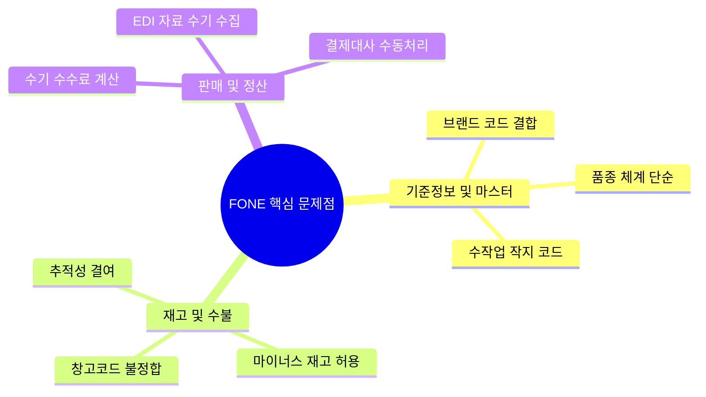

# FONE 시스템 문제점 및 개선 제안 (Strategic Direction Report) 요약

이 문서는 [원문 PPTX 텍스트](file:///C:/supersonic/llm_wiki/raw/sources/extracted/fone-c348c1c5d9_extracted.txt)를 바탕으로, 신성통상 IT기획팀에서 작성한 FONE 시스템 현황 및 주요 업무 분야별 문제점과 차세대 개선 제안을 **4단계 PI 프레임워크(As-Is, To-Be, Gap, 해결방안)**에 맞추어 재구성한 지식 카드입니다.

---

## 📊 F-ONE 시스템 메뉴 현황
* **전체 가용 화면 수**: 총 383개 (조회 화면 234개, 등록 화면 149개)
* **주요 마스터 등록 화면**: 56개 (영업관리 17개, POS 14개, 정보관리 8개, 물류 6개 등)
* **정리 대상**: 현재 사용되지 않는 **미사용 프로그램 63개**에 대한 화면 Close 처리가 시급함.

---

## 🗺️ 영역별 4단계 PI 분석 및 개선안

### 1. 기준정보 및 마스터 데이터 관리

#### 📌 브랜드 및 서브브랜드 코드 체계 개선
* **As-Is (현행)**: 브랜드와 서브브랜드가 물리적 코드 체계(알파벳 A~Z 구조)에 강하게 결합되어 유연성이 낮으며, 현재 잔여 알파벳이 Q, S, T, W 4개에 불과하여 신규 브랜드 확장이 어려움.
* **To-Be (목표)**: 신규 브랜드 및 유통망별 확장에 대처할 수 있는 유연한 결합 및 유휴 코드 체계 확보.
* **Gap (격차)**: 고정형 단일 문자 코드 구조의 한계.
* **RFP 해결방안**: 브랜드/서브브랜드 코드에 숫자 코드를 도입하여 조합 수를 대폭 확장(A~Z + 1~9 조합 시 최대 1,225개 조합 확보).

#### 📌 제품 및 스타일 코드 등록 (병목 지점)
* **As-Is (현행)**: 수작업 작업지시서에 의존하여 제품 및 스타일 코드를 수기로 복잡하게 생성하며, 연도/시즌/차수 관리 기준 모호로 인한 데이터 중복 가능성 및 본 제품과 샘플 제품의 코드 혼선 존재.
* **To-Be (목표)**: 기획-작지-코드 생성의 유기적 자동화 및 샘플/본제품의 완벽한 이력 격리.
* **Gap (격차)**: 상품 기획 데이터(PLM)와 ERP 마스터 시스템 간 연동 단절.
* **RFP 해결방안**: **Centric PLM과의 연동 인터페이스**를 구축하여 기획 데이터 기반으로 제품 코드를 자동 생성하고, 상태값(기획, 발주, 단종)에 따른 시스템적 통제 적용.

---

### 2. 재고 및 수불 관리

#### 📌 재고 추적성(Traceability) 결여 및 마이너스 재고
* **As-Is (현행)**: 재고 변동의 정확한 수불 원인 추적이 불가능하고, 이동 중 재고의 가시성 부재로 실시간 가용 재고 파악 불가. 또한 판매 등록을 차단하지 않아 마이너스 재고를 허용함으로써 장부와 실재고의 괴리가 심화됨.
* **To-Be (목표)**: 입고부터 판매까지 모든 물류 트랜잭션을 전표 단위로 추적하고 마이너스 재고 발생을 통제함.
* **Gap (격차)**: 실시간 수불전표 연계 메커니즘 부재 및 판매 시 재고 정합성 검증 기능 결여.
* **RFP 해결방안**:
  - 모든 재고 증감을 **'수불 전표'** 단위로 연결하여 추적성 확보.
  - 실시간 판매 시 재고 검증 로직을 도입하여 마이너스 재고 발생 차단.
  - 전산 상 '이동 중 재고' 상태값을 추가하여 재고 가시성 확보.

#### 📌 WMS - FONE 창고 기준정보 불일치
* **As-Is (현행)**: WMS(창고관리)와 FONE ERP 간의 창고 코드가 다르게 매핑되어 연동 처리 시 데이터 오차가 누적됨.
* **To-Be (목표)**: 물류창고 및 매장 가상 창고 코드의 완전 일원화.
* **Gap (격차)**: 시스템 간 기준정보 불정합 및 매핑 룰 관리 부실.
* **RFP 해결방안**: WMS와 FONE의 **창고 마스터 코드를 1:1로 일원화**하고 인터페이스 프로세스를 정립.

---

### 3. 판매 및 정산 프로세스

#### 📌 중간관리자 수수료 산정 및 대사 수작업
* **As-Is (현행)**: 프로모션, 마진율, 공제 항목이 매장별로 매우 복잡하게 얽혀 있어 담당자가 매월 엑셀을 활용해 수기 가공 및 수수료를 계산함.
* **To-Be (목표)**: 계약 정보와 연동하여 자동으로 수수료를 계산하고 역발행 전표까지 자동화.
* **Gap (격차)**: 예외 정산 조건에 대한 시스템 계산 로직 및 기준 테이블 부재.
* **RFP 해결방안**: 
  - **Rule 기반 자동 수수료 산정 엔진**을 탑재하여 슬라이딩 마진 및 매출 단계별 차등 수수료율 자동 반영.
  - 공제 항목 사전 세팅 및 **Trustbill 연동**을 통한 수수료 전표의 세금계산서 역발행 자동화.

#### 📌 유통망 EDI 취합 및 결제 대사 지연
* **As-Is (현행)**: 백화점 등 백오피스에서 정산 데이터를 수기로 내려받아 카드/현금 등의 영수증 실적과 미수금을 대조하여 업무 효율이 극히 낮음.
* **To-Be (목표)**: 대사 데이터를 자동 수집 및 비교하여 예외 관리.
* **Gap (격차)**: 외부 유통망 연동 스케줄러 및 대사 프로세스 자동화 엔진 부재.
* **RFP 해결방안**: 유통망 **EDI 자동 수집 파이프라인**(RPA 및 인터페이스 허브)을 구축하고, 펌뱅킹 연동을 통한 카드/현금/포인트 입금 대조 자동화.

---

## 🔗 연계 지식 카드 (Obsidian Links)
* **상위 개념**: [[fone-as-is-analysis|FONE 현행 분석]], [[master-data-governance|기준정보 관리 체계]], [[sales-settlement-automation|영업관리 정산 자동화]]
* **연계 솔루션**: [[centric-plm|센트릭 PLM]], [[wms|WMS 창고관리]]
* **후속 조치**: [[영업관리_RFP_요구사항_정의서_최종|영업관리 RFP 요구사항 정의서]]
