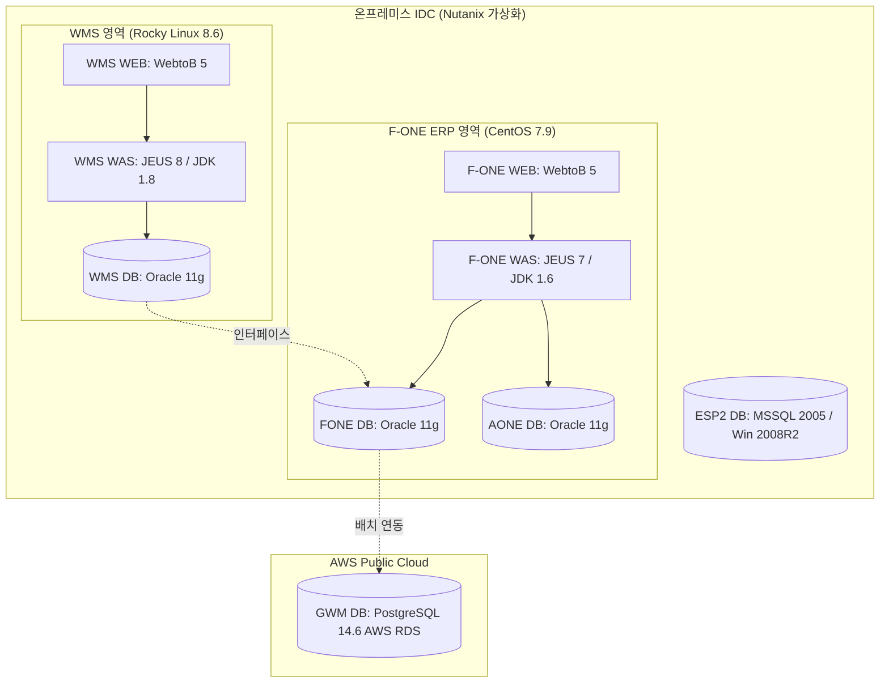

# FONE_아키텍처.drawio 요약 (인프라 아키텍처 및 시스템 구성 분석)

이 문서는 [원문 PDF 텍스트](file:///C:/supersonic/llm_wiki/raw/sources/extracted/fone-drawio-ff584e7271_extracted.txt)를 바탕으로, 신성통상의 코어 ERP(FONE/AONE), WMS, 그리고 AWS 자사몰(GWM)의 인프라 서버 구성 및 미들웨어 환경을 분석하고, 차세대 시스템 현대화를 위한 추진 과제를 **4단계 PI 프레임워크(As-Is, To-Be, Gap, 해결방안)**에 맞춰 요약한 지식 카드입니다.

---

## 🗺️ 현행 인프라 아키텍처 구성도

---

## 🧭 인프라 아키텍처 관점의 4단계 PI 분석

### 1. 코어 ERP(FONE) WAS의 Open JDK 1.6 노후화

* **As-Is (현행)**:
  * F-ONE WAS 시스템이 **Open JDK 1.6.0.45** 및 **JEUS 7** 기반의 극도로 노후화된 자바 사양에서 구동되고 있습니다. 
  * 이 사양은 최신 자바 기능(람다, 스트림 API 등) 및 Modern Spring Boot 프레임워크의 사용이 불가능하며, Java 6 계열의 보안 취약점 패치 중단으로 인해 심각한 전사 정보 보안 리스크를 안고 있습니다.
* **To-Be (목표)**: 업계 표준의 최신 Java LTS 버전(Java 17 또는 21) 및 경량 오픈소스 WAS 프레임워크(Spring Boot 내장 Tomcat 또는 최신 JEUS) 환경으로 현대화.
* **Gap (격차)**: 레거시 코드의 Java 최신 스택(JVM) 간 호환성 결여 및 미들웨어 버전 업그레이드 전략 부재.
* **RFP 해결방안**:
  * 차세대 시스템 구축 시 WAS 런타임을 **Open JDK 17/21 LTS 버전**으로 전면 업그레이드하고, 애플리케이션 프레임워크를 **Spring Boot** 최신 스펙으로 재구축.

---

### 2. 단종 임박 레거시 데이터베이스 및 OS 방치

* **As-Is (현행)**:
  * ESP2 DB(수출영업관리 DB)가 **MSSQL 2005** 및 **Windows Server 2008 R2**에서 구동 중이며, 두 솔루션 모두 공식 기술 지원(EOS) 및 보안 업데이트가 완전히 종료된 상태로 장비 장애나 해킹 공격 시 대응이 불가합니다.
  * FONE/AONE/WMS DB 모두 **Oracle 11.2.0.4.0** 구버전 및 CentOS 7.9(2024년 6월 지원 종료) 환경에 의존하고 있습니다.
* **To-Be (목표)**: 전사 OS 및 DB 사양을 제조사 공식 지원 범위 내의 최신 버전으로 일제 전환하여 인프라 중단 리스크 제거.
* **Gap (격차)**: 인프라 현대화 예산 확보 및 노후 서버 마이그레이션 실행 계획 부재.
* **RFP 해결방안**:
  * MSSQL 2005 기반 ESP2 DB를 차세대 표준 데이터베이스 사양으로 스키마 마이그레이션 수행 및 Windows Server 최신 에디션 또는 Linux 환경으로 이전.
  * Oracle DB 인스턴스를 최소 19c 이상으로 업그레이드하고, OS 역시 Rocky Linux 8/9 등 기술 지원이 보장되는 엔터프라이즈 리눅스 표준으로 전환.

---

### 3. 온프레미스 IDC와 AWS 퍼블릭 클라우드 간 수작업/배치 결합

* **As-Is (현행)**:
  * 온프레미스 Nutanix 가상화 환경에 구축된 FONE DB(Oracle 11g)와 AWS 클라우드 상에서 동작하는 자사몰 GWM DB(PostgreSQL 14.6 AWS RDS)가 배치 파일 전송 방식으로 결합되어 있어 실시간 매출 및 가용재고 데이터의 불정합을 유발합니다.
* **To-Be (목표)**: 하이브리드 클라우드 환경 간 실시간 데이터 파이프라인 정립을 통한 정합성 확보.
* **Gap (격차)**: 온프레미스-클라우드 간 실시간 API 및 CDC(Change Data Capture) 연동 레이어 부재.
* **RFP 해결방안**:
  * **하이브리드 메시징 버스 구축**: 온프레미스 IDC와 AWS 간 전용선(Direct Connect) 또는 VPN 터널을 구축하고, **AWS DMS(Database Migration Service)** 또는 **Kafka Connect** 기반의 실시간 데이터 파이프라인을 연계하여 온오프라인 통합 재고/판매 현황의 실시간성 확보.

---

## 🔗 연계 지식 카드 (Obsidian Links)

* **상위 개념**: [[fone-as-is-analysis|FONE 현행 분석]], [[master-data-governance|기준정보 관리 체계]]
* **연계 데이터 스키마**: [[ss10db-tables-c6cb6d8005|SS10DB_TABLES]]
* **연계 엔티티**: [[fa-one-fone|FA-ONE & FONE ERP]], [[wms|WMS]]
