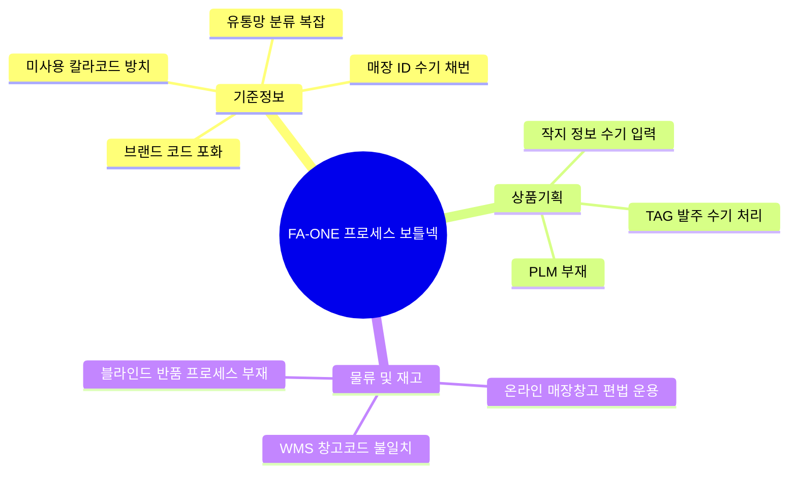

# 패션관리시스템_process구성도(물류출고까지) 요약

이 문서는 [원문 PPTX 텍스트](file:///C:/supersonic/llm_wiki/raw/sources/extracted/process-4203c55383_extracted.txt)를 바탕으로, 정보관리, 상품기획, 물류관리 영역의 프로세스를 정밀하게 해부하고 주요 고충점과 차세대 개선 방안을 **4단계 PI 프레임워크(As-Is, To-Be, Gap, 해결방안)**에 맞추어 도출한 지식 카드입니다.

---

## 🗺️ 영역별 프로세스 이슈맵

---

## 🧭 영역별 4단계 PI 상세 분석

### 1. 기준정보 관리 영역

#### 📌 브랜드 및 마스터 코드 포화
* **As-Is (현행)**: 브랜드와 서브브랜드가 단일 알파벳 조합(A~Z)에 묶여 있으며, 현재 잔여 코드가 4개(Q, S, T, W)에 불과하여 신규 브랜드 론칭 및 사업 확장에 심각한 한계가 존재합니다. 또한 칼라 마스터의 경우 총 1,434개 코드 중 54%인 784개가 사용되지 않는 미사용 데이터로 방치되어 정합성이 저하됩니다.
* **To-Be (목표)**: 무제한 확장이 가능한 브랜드 코드셋 표준을 수립하고 미사용 마스터 데이터를 상시 정리하는 거버넌스 확보.
* **Gap (격차)**: 코드 설계의 용량 확장성 결여 및 마스터 라이프사이클 관리 체계 부재.
* **RFP 해결방안**:
  * 알파벳-숫자 혼용 조합(Alphanumeric) 또는 3자리 이상 브랜드 코드 체계를 도입하여 조합 수 확장.
  * 기준정보 관리 시스템(MDM)에 **마스터 휴면 기준**을 설정하여 1년 이상 트랜잭션이 없는 코드는 자동 비활성화(Soft Delete) 처리.

#### 📌 매장 정보 등록 및 이력 관리의 파편화
* **As-Is (현행)**: 
  * 매장 ID를 등록할 때 규칙(브랜드+유통형태+상권+SEQ)에 따라 **수기로 채번**하여 오입력이 빈번합니다.
  * 매장 분류(유통망 분류, 매장 유형, 회계유통망, 운영형태)가 지나치게 중복 및 세분화되어 관리가 어렵습니다.
  * 매장 양수양도, 임대 조건 변경 등 매장 정보 변경에 대한 **변경 이력(History) 관리 기능이 부재**하여 현업이 엑셀에 수기로 기록합니다.
* **To-Be (목표)**: 매장 ID의 100% 자동 채번, 일원화된 매장 분류 표준, 매장 데이터 변경 이력의 DB 자동 보존.
* **Gap (격차)**: 매장 마스터 관리의 자동화 로직 부재 및 데이터 변경 추적 스키마 미비.
* **RFP 해결방안**:
  * 매장 신규 등록 승인 시 규칙 기반으로 **매장 ID 자동 생성(Auto-increment/Rule 기반)**.
  * 매장 마스터 정보 변경 시 트리거(Trigger) 또는 CDC(Change Data Capture) 패턴을 적용하여 **매장 변경 이력 테이블(T_SHOP_HIST)에 실시간 적재**.
  * 업무 기능별로 입점, 계약, 판매, KICC 단말기 등 **탭(Tab)별 화면 권한을 분리**하여 부서간 R&R을 명확히 함.

---

### 2. 상품기획 영역

#### 📌 작업지시서 관리 및 TAG 발주 수작업
* **As-Is (현행)**: 상품기획팀에서 품번 채번 및 제품 기본 속성, 칼라, 사이즈 스펙을 수기로 입력하고, 소싱팀이 이를 S-ONE에 이관하여 사전원가를 계산합니다. 이후 RFID/바코드 출력을 위한 **TAG 발주를 매번 브랜드 특성에 맞추어 수기로 작성**하여 비효율이 극대화됩니다.
* **To-Be (목표)**: 기획-디자인-소싱-발주 프로세스의 전산 일원화 및 TAG 발주 프로세스 100% 자동화.
* **Gap (격차)**: 상품 기획 전용 솔루션(PLM)의 부재 및 TAG 발주 연동 로직 단절.
* **RFP 해결방안**:
  * **Centric PLM 연동**: 기획 및 디자인 정보는 PLM에서 마스터를 생성하고, 승인 시 FONE ERP의 작업지시(`T_WORK_INDC`) 및 제품(`T_PRDT`) 테이블로 자동 전송.
  * **TAG 자동 발주 엔진**: 작업지시서의 발주 수량 및 Assort/Solid 패킹 정보와 연계하여 협력업체 생산 TAG 발주 요건을 자동으로 감지하고, 인쇄 시스템으로 인터페이스를 자동 전송.

---

### 3. 물류 및 재고 관리 영역

#### 📌 FONE ERP - WMS 창고 마스터 불일치
* **As-Is (현행)**: 물류센터 관리 시스템(WMS)과 FA-ONE ERP 간의 창고 노드 구조가 다르게 설계되어 물류 이동(창고간 이동, 이관 등) 트랜잭션 시 실시간 수불 대사가 불가능합니다.
* **To-Be (목표)**: ERP와 WMS 간 창고 및 센터 데이터의 1:1 매핑 일원화.
* **Gap (격차)**: 두 시스템 간 기준정보 비표준 및 수불 시점 불일치.
* **RFP 해결방안**: WMS 마스터 구축 시 ERP 창고 코드를 Base Key로 일원화하고, 모든 창고 이동 트랜잭션을 실시간 인터페이스 처리.

#### 📌 온라인 수불 편법 처리 및 블라인드 반품
* **As-Is (현행)**: 
  * 온라인(B2C) 물류 재고를 ERP상에서 '매장'으로 가상 등록하여 매장<->창고 간 수기 이동 전표를 발행하는 편법을 사용 중입니다.
  * 매장 반품 시 원 거래 전표 근거가 없는 **블라인드 반품(Blind Return)**을 수용하여, 실재고와 장부재고의 괴리가 지속 발생합니다.
* **To-Be (목표)**: 온라인 전용 물류 창고 수불 프로세스 정립 및 실 거래 기반의 반품 통제 검증.
* **Gap (격차)**: 온라인 수불 모델 설계 부재 및 반품 시 원 판매 정보 역추적 메커니즘 결여.
* **RFP 해결방안**:
  * 온라인 재고를 '가상 매장'이 아닌 **온라인 전용 창고(B2C WH) 구조**로 정립하고, WMS 실시간 I/F를 연동하여 온라인 단독 수불 프로세스 구축.
  * POS 판매 영수증 및 매출 확정 전표와 연동되는 **반품 승인 검증 API**를 구현하여 블라인드 반품을 원천 금지.

---

## 🔗 연계 지식 카드 (Obsidian Links)

* **상위 개념**: [[fone-as-is-analysis|FONE 현행 분석]], [[master-data-governance|기준정보 관리 체계]]
* **연계 프로세스**: [[store-master-data-cleanup|매장 기준정보 정비]], [[product-master-data-cleanup|상품 기준정보 정비]], [[wms-fone-inventory-integration|WMS-FONE 재고 연계]], [[plm-fone-integration|PLM-FONE 연계]]
* **연계 솔루션**: [[centric-plm|Centric PLM]], [[wms|WMS]]
