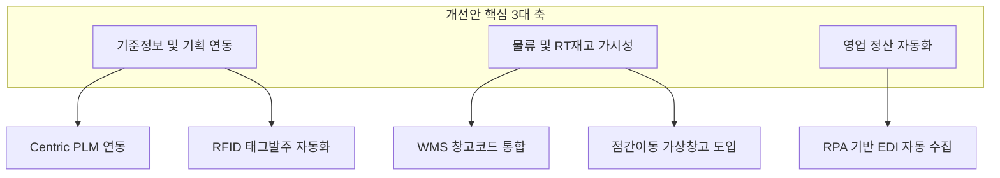

# 패션관리시스템_주요이슈_개선안 요약

이 문서는 [원문 PPTX 텍스트](file:///C:/supersonic/llm_wiki/raw/sources/extracted/resource-5cc9c9f664_extracted.txt)를 바탕으로, 레거시 시스템의 구조적 보틀넥을 해소하기 위한 핵심 개선 과제를 **4단계 PI 프레임워크(As-Is, To-Be, Gap, 해결방안)**에 맞추어 종합 요약한 지식 카드입니다.

---

## 🧭 핵심 개선 과제 4단계 PI 분석

### 1. 기준정보 표준화 및 PLM-RFID 연동

* **As-Is (현행)**:
  * 마스터 데이터(칼라 코드 등)가 정리되지 않고 노후 데이터(1,434개 중 784개 미사용)가 방치되어 있습니다.
  * 기획-소싱 데이터 단절로 인해 작업지시 및 상품 코드를 수기 입력하며, 바코드/RFID를 위한 **태그 라벨 발주 역시 수작업**으로 진행되어 오류 발생 가능성이 높습니다.
* **To-Be (목표)**: Centric PLM 기반 단일 소스(Single Source) 체계 확립, 태그 발주의 완전 자동화.
* **Gap (격차)**: 기획-ERP-협력업체 발주 시스템 간의 데이터 거버넌스 및 자동 연동 메커니즘 부재.
* **RFP 해결방안**:
  * **칼라 마스터 정비**: 칼라 코드를 650개 표준 셋으로 일제 정비하고, PLM 기준정보 거버넌스를 이식.
  * **RFID 연계 자동 태그 발주**: 협력업체 생산 의뢰 시 ERP 작업지시 데이터와 결합하여 RFID 발주 정보를 인쇄 시스템에 실시간 인터페이스.

---

### 2. 점간 이동(RT) 및 이동 중 재고 가시성 확보

* **As-Is (현행)**:
  * 매장 간 상품 이동(RT, Shop Move) 시, 보낸 매장(인도)에서 전산 처리를 하고 받는 매장(인수)에서 확정하기 전까지의 **이동 중 재고에 대한 소유권 및 재고 귀속이 모호**하여 실시간 재고 오차 및 분실 재고 추적에 어려움이 있습니다.
* **To-Be (목표)**: 이동 중 재고의 소유권을 명확히 트래킹하여 재고 손실 및 분실을 예방.
* **Gap (격차)**: 전산상 '이동 중 가상 상태(Transit)'를 정의하는 버퍼 노드 부재.
* **RFP 해결방안**:
  * **[이동중 가상창고(Transit Virtual Warehouse)]** 개념을 도입하여 수불 로직을 재정의.
  * 인도 매장 확정 시 재고를 즉시 **'이동중 가상창고'**로 귀속시키고, 인수 매장이 최종 인수 확정을 누르는 시점에 가상창고에서 인수 매장 재고로 전환하는 트랜잭션 수불 체계 구현.

---

### 3. 반품 및 자가소모 물류 프로세스 단일화

* **As-Is (현행)**:
  * 매장이나 온라인에서 사은품, 기부, 폐기 등의 **자가소모**를 처리할 때, 시스템상 반드시 물류센터를 경유(매장 반품 -> 물류센터 입고 -> 자가소모 출고)해야 하는 다단계 전표 편법 처리가 강제되어 실무 리소스가 낭비됩니다.
* **To-Be (목표)**: 현장에서 즉각 자가소모를 처리하고 실시간 수불에 반영하는 단일 단계 프로세스 전환.
* **Gap (격차)**: 매장/온라인 다이렉트 수불 유형 및 현장 처리 권한 부재.
* **RFP 해결방안**:
  * 매장 및 온라인 시스템 내 **'매장 자가소모 처리' 단독 메뉴**를 신설하여, 물류센터 가상 반품 단계 없이 즉시 매장 재고에서 자가소모 수불(폐기, 판촉, 증정 등)로 감액 처리하는 기능 구현.

---

### 4. 매출 목표 관리 및 정산 RPA 자동화

* **As-Is (현행)**:
  * 매장별 연간/월간 매출 목표 설정 시, 목표가 수정되어도 변경 전 이력(History)과 사유가 보존되지 않아 신뢰도가 낮습니다.
  * 유통망(백화점 등)의 정산 자료 수집을 담당자가 매번 수기로 다운로드하여 엑셀 대사를 진행하느라 리드타임이 지연됩니다.
* **To-Be (목표)**: 매출 목표의 버전별 이력(History) 및 승인 프로세스 제공, 정산 자료 수집 자동화.
* **Gap (격차)**: 목표 변경 이력 보존용 스키마 및 수집 자동화 기술(RPA) 도입 미비.
* **RFP 해결방안**:
  * 매출 목표 테이블에 버전(Version) 및 승인 로그 필드를 추가하여 **매출 목표 변경 히스토리 추적성** 확보.
  * **RPA(Robotic Process Automation) 엔진**을 도입하여 백화점/유통망 포털에서 매출/수수료 정산 EDI 원본 데이터를 스케줄링 방식으로 매일 자동 수집 및 입금 대사 매칭 자동화.

---

## 🔗 연계 지식 카드 (Obsidian Links)

* **상위 개념**: [[fone-as-is-analysis|FONE 현행 분석]], [[sales-settlement-automation|영업관리 정산 자동화]]
* **하위 개념**: [[master-data-governance|기준정보 관리 체계]], [[product-master-data-cleanup|상품 기준정보 정비]], [[wms-fone-inventory-integration|WMS-FONE 재고 연계]]
* **연계 엔티티**: [[centric-plm|Centric PLM]], [[wms|WMS]]
