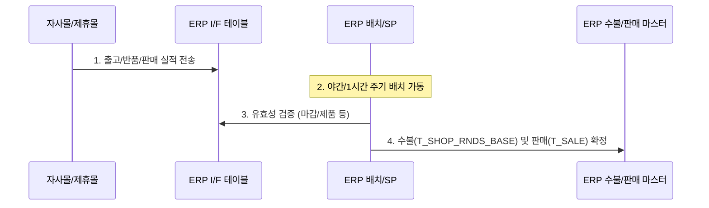

# 온라인정산프로세스_보충반영분완료 요약

이 문서는 [원문 PPTX 텍스트](file:///C:/supersonic/llm_wiki/raw/sources/extracted/resource-b2218e9191_extracted.txt)를 바탕으로, 자사몰(굿웨어몰) 및 제휴몰 주문의 출고, 반품, 판매, 구매 확정 시 발생하는 ERP 인터페이스 및 재고 수불 메커니즘의 비효율을 진단하고 개선 방향을 **4단계 PI 프레임워크(As-Is, To-Be, Gap, 해결방안)**에 맞추어 정리한 지식 카드입니다.

---

## 🧭 온라인 정산 및 수불 4단계 PI 분석

### 1. 자사몰 판매 매출의 이중 처리 (결제 vs 구매확정)

* **As-Is (현행)**:
  * 자사몰(굿웨어몰) 주문 건은 1차 결제 완료 시점에 가매출(판매실적)을 잡았다가, 고객의 **'구매 확정'**이 발생하면 이전 결제 기준 판매 실적을 삭제(`DEL_DAY` 필드 업데이트)하고, 구매 확정 기준으로 매출 실적을 재작성하는 복잡한 데이터 재생성 로직이 탑재되어 있습니다.
  * 전월 데이터의 삭제/재생성이 매달 야간 배치(`SP_GWM_SALE_SHOP_RNDS_CONFIRM`)를 통해 발생하여 회계상 마감 전 매출 왜곡 위험과 DB 트랜잭션 부하를 초래합니다.
* **To-Be (목표)**: 매출 인식 기준을 '구매 확정' 시점으로 단일화하여 이중 전표 처리와 삭제 트랜잭션의 원천 차단.
* **Gap (격차)**: 주문 결제-구매확정 라이프사이클 간의 결합성 및 ERP 매출 귀속 기준 불합리.
* **RFP 해결방안**:
  * ERP 매출 인식 시점을 **'구매 확정' 시점 단일 트랙**으로 개편하여, 결제 시점에는 재고 예약(Logical Lock)만 발생시키고 실 판매 전표(`T_SALE`)는 구매 확정 시점에만 1회 생성하는 단순화 설계 도입.

---

### 2. 가상 매장(STS027 등)을 경유한 비실재적 가상 수불 남발

* **As-Is (현행)**:
  * 온라인 반품이나 취소 발생 시, WMS 물류창고(OA)에서 가상 출고지 매장(WMS 센터 가상 매장: `STS027`, `STS015` 등)으로 단가는 0원 처리하고 수량만 이동시키는 비실재적 출고 전표(`T_TRAN_SPEC`)가 생성됩니다.
  * 이러한 가상 매장 수불은 실제 물류 흐름과 다른 전산상의 재고 메우기용 꼼수로 활용되어, 실재고 대사와 수불 분석에 혼선을 야기합니다.
* **To-Be (목표)**: 가상 매장 경유 없는 물류창고(WMS B2C 창고)와 고객 간의 직접 반품 수불 체계 확립.
* **Gap (격차)**: 온라인 전용 창고 노드 부재 및 ERP 수불 유형의 다양성 결여.
* **RFP 해결방안**:
  * **온라인 전용 가상 창고/수불 노드 제거**: ERP 내에 B2C 전용 물류창고 마스터를 신설하고, 온라인 반품 시 `[고객] -> [B2C 반품창고]`로의 직접 입고 수불 유형을 정의하여 가상 매장(`STS027`) 경유 단계 제거.

---

### 3. 배치 연동으로 인한 실시간 재고/매출 정합성 결여

* **As-Is (현행)**:
  * 온라인 출고/반품 실적이 인터페이스 테이블(`T_GWM_RNDS_OUTB`, `T_GWM_RNDS_RETURN`)로 전송된 후, 야간 배치 및 1시간 주기 프로시저(`SP_GWM_RNDS_OUTB`, `SP_GWM_RNDS_RETURN`)가 실행되어야만 매장 재고(`T_SHOP_STOCK`)와 수불 마스터가 갱신됩니다.
  * 이로 인해 주간 영업 시간에는 온라인 주문으로 인한 실시간 재고 변동분이 ERP에 반영되지 않아, 매장이나 타 채널에서 품절 상품이 중복 판매되는 오버셀링(Over-selling) 리스크가 발생합니다.
* **To-Be (목표)**: 모든 온라인 입출고 트랜잭션의 실시간(Real-time) 수불 반영 및 재고 갱신 보장.
* **Gap (격차)**: 배치(Batch) 위주의 노후 레거시 동기화 아키텍처.
* **RFP 해결방안**:
  * **이벤트 기반 실시간 수불 API**: 주문 출고/반품 확정 시 배치 대기 없이 실시간으로 수불 프로시저를 직접 호출하는 REST API/Message Queue 연동 체계 구현.

---

## 🔗 연계 지식 카드 (Obsidian Links)

* **상위 개념**: [[sales-settlement-automation|영업관리 정산 자동화]], [[fone-as-is-analysis|FONE 현행 분석]]
* **하위 개념**: [[wms-fone-inventory-integration|WMS-FONE 재고 연계]], [[master-data-governance|기준정보 관리 체계]]
* **연계 엔티티**: [[fa-one-fone|FA-ONE & FONE ERP]], [[wms|WMS]]
