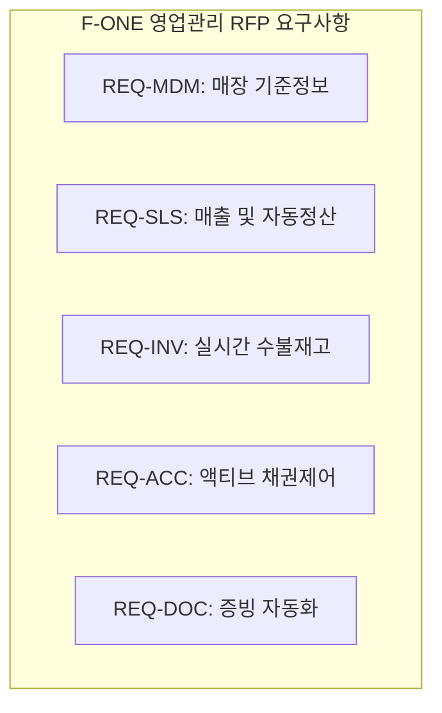

# 영업관리_RFP_요구사항_정의서(20260424) 요약

이 문서는 [원문 DOCX 텍스트](file:///C:/supersonic/llm_wiki/raw/sources/extracted/rfp-20260424-06e9cd0154_extracted.txt)를 바탕으로, 차세대 패션 ERP(F-ONE) 영업관리 영역의 기능적 요구사항을 **4단계 PI 프레임워크(As-Is, To-Be, Gap, 해결방안)**에 맞추어 체계적으로 요약한 지식 카드입니다.

---

## 🧭 영업관리 핵심 요구사항 4단계 PI 분석

### 1. 매장 기준정보 및 이력 관리

* **As-Is (현행)**:
  * 매장 점주나 사업자 정보가 변경될 때 새로운 매장코드가 채번되어 과거 데이터와 단절되고, 계약 내용이나 매장 변경 사항에 대한 이력 관리가 어려워 시계열 분석이 불가합니다.
  * 부서별 입력 경계가 없어 데이터 입력이 누락되거나 다른 부서의 데이터를 덮어쓰는 간섭이 발생합니다.
* **To-Be (목표)**: 물리적 매장 거점 중심의 고유 코드를 유지하고, SCD(Slowly Changing Dimension) Type 2 기반의 타임스탬프 이력 추적 및 R&R 기반 Workflow 승인 통제 구현.
* **Gap (격차)**: 과거 매장 상태 조회용 이력 스키마의 부재 및 부서별 데이터 입력 통제 권한 엔진 미비.
* **해결방안 (RFP 요구사항)**:
  * **REQ-MDM-001**: 거점 중심의 영구 매장코드를 PK로 설정하고, 점주명/계약조건 변경 시 타임스탬프 기준 이력을 누적하는 SCD Type 2 이력 관리 엔진 설계.
  * **REQ-MDM-002**: 영업(계약), 회계(금융), 물류(배송) 등 부서별 입력 영역 분리 탭(Tab) 설계 및 필수 필드 Workflow 승인 프로세스 구축.

---

### 2. 매출 확정 및 자동 정산 엔진

* **As-Is (현행)**:
  * 유통망(롯데, 현대, 신세계 등)의 EDI 매출 데이터를 수기로 다운로드하여 엑셀 대사를 직접 수행하느라 정산 리드타임이 장기화됩니다.
  * ERP 매출과 유통망 정산액, 실제 입금액의 불일치 원인을 수기로 전수 조사하여 보정 전표를 작성합니다.
* **To-Be (목표)**: EDI 수집 스케줄러와 3-Way Auto-Matching 엔진을 가동하여 1원 단위 정합성 검증의 Zero-Touch(자동 확정)화 구현.
* **Gap (격차)**: 외부 유통망 연동 API/RPA 파이프라인 및 자동 대사 검증(Matching) 로직 부재.
* **해결방안 (RFP 요구사항)**:
  * **REQ-SLS-001**: Integration Hub 기반의 외부 유통망 EDI 및 카드사/VAN사 입금 API 스케줄링 자동 수집 파이프라인 구축.
  * **REQ-SLS-002**: `[ERP 매출] - [유통망 정산액] - [실제 입금액]` 간의 **3-Way Auto-Matching 엔진** 구축 및 예외 관리 대시보드(불일치 원인 자동 추천 및 보정 전표 생성 기능) 제공.

---

### 3. 실시간 재고 가시성 및 수불 관리

* **As-Is (현행)**:
  * 거점(Hub)-종속(Spoke) 매장 구조에서 실시간 매출 배분과 재고 차감이 유기적으로 연동되지 못하고 수기나 가상창고 편법 전표에 의존합니다.
  * 매장 자가소모(증정, 비품 등) 처리 시 물류센터로 가상 반품 처리하는 불필요한 물류 프로세스가 유발됩니다.
* **To-Be (목표)**: Hub-Spoke 간 실시간 논리적 수불 모델 확립 및 매장 POS/App 단에서의 즉각 자가소모 직접 처리.
* **Gap (격차)**: 실시간 계층 구조의 수불 로직 부재 및 물류센터 미경유 다이렉트 수불 유형 미비.
* **해결방안 (RFP 요구사항)**:
  * **REQ-INV-001**: Hub-Spoke 실시간 논리적 수불 엔진을 구현하여 Spoke 매장 판매 시 거점 재고 실시간 차감 및 가상창고 없는 점간 이동(RT) 트랜잭션 관리.
  * **REQ-INV-002**: POS/App 상에서 직접 자가소모 등록 시 판촉비 등 비용 계정으로 전표를 자동 연동하고, 물류센터 반품 단계를 완전 스킵하는 현장 완결형 프로세스 구현.

---

### 4. 액티브 리스크 및 채권 모니터링

* **As-Is (현행)**:
  * 채권 잔액 관리가 일 배치 수작업에 의존하여, 연체나 초과 채권이 발생한 불량 매장으로의 출고나 판매 차단 조치가 실시간으로 이루어지지 않아 부실 채권 위험이 큽니다.
* **To-Be (목표)**: CMS 입금 즉시 채권을 차감(Real-time Offset)하고, 임계치 초과 시 매장 판매 기능을 차단하여 실시간 사고를 예방하는 액티브 통제 메커니즘 구축.
* **Gap (격차)**: CMS 금융망 실시간 연동 및 매장 판매/접속 차단 제어(Auto-Blocking) 로직 부재.
* **해결방안 (RFP 요구사항)**:
  * **REQ-ACC-001**: CMS 데이터 실시간 채권 차감 및 임계치 초과 시 리스크 등급에 따라 판매 기능/ERP 접속을 즉시 차단(Auto-Blocking)하는 3단계 제어 로직 탑재.

---

### 5. 증빙 자동화 및 연동 관리

* **As-Is (현행)**:
  * 정산 확정 후 세금계산서를 Trustbill 사이트에서 수작업으로 역발행하고, 타 부서에서 발생하는 비용(AS 수선비, 소모품 등)에 대한 정산 공제 데이터 매핑이 수기로 처리되어 누락 리스크가 높습니다.
* **To-Be (목표)**: Trustbill API 연동 및 타 부서 비용 발생 데이터의 실시간 통합 공제 반영 자동화.
* **Gap (격차)**: Trustbill API 연동 인터페이스 및 타 업무(AS, 소모품 구매) 연동 허브 결여.
* **해결방안 (RFP 요구사항)**:
  * **REQ-DOC-001**: Trustbill 연동을 통한 전자세금계산서 역발행 자동화, 부자재/AS 수선비 비용의 자동 정산 공제 반영, 국세청 전송 상태 통합 조회 뷰어 탑재.

---

## 🔗 연계 지식 카드 (Obsidian Links)

* **상위 개념**: [[sales-settlement-automation|영업관리 정산 자동화]], [[master-data-governance|기준정보 관리 체계]]
* **연계 프로세스**: [[store-master-data-cleanup|매장 기준정보 정비]], [[wms-fone-inventory-integration|WMS-FONE 재고 연계]], [[fone-as-is-analysis|FONE 현행 분석]]
* **연계 엔티티**: [[fa-one-fone|FA-ONE & FONE ERP]], [[wms|WMS]]
