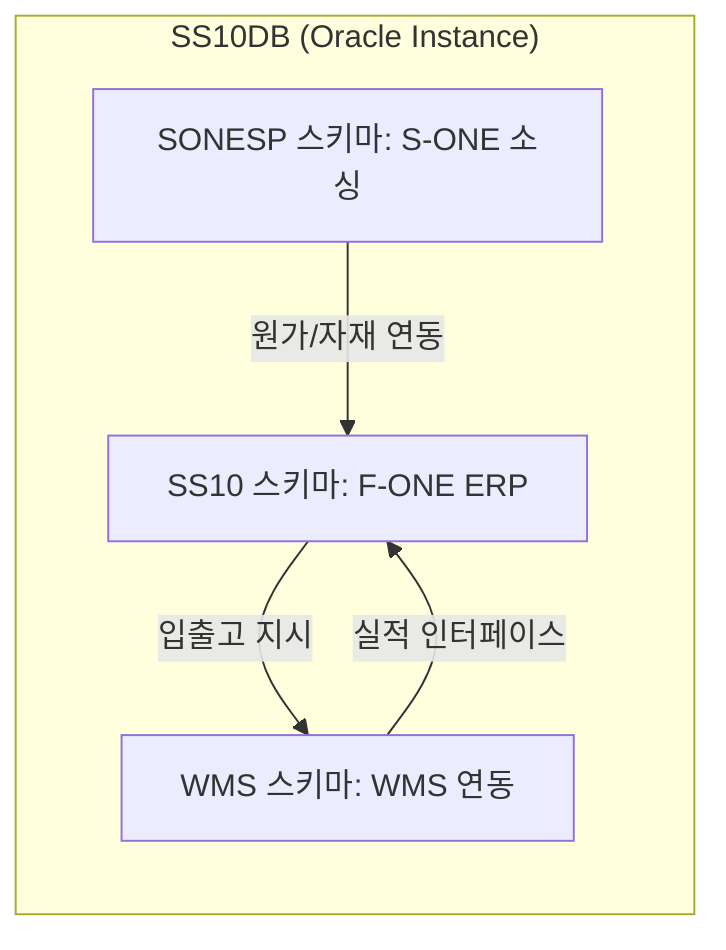

# SS10DB_TABLES 요약 (메인 DB 테이블 메타데이터 분석)

이 문서는 [원문 XLS 복구 텍스트](file:///C:/supersonic/llm_wiki/raw/sources/extracted/ss10db-tables-c6cb6d8005_extracted.txt)를 바탕으로, 신성통상 패션 ERP의 심장부인 SS10DB의 스키마 및 주요 테이블 구조의 현황과 데이터 거버넌스적 문제를 **4단계 PI 프레임워크(As-Is, To-Be, Gap, 해결방안)**에 맞추어 정리한 지식 카드입니다.

---

## 📊 SS10DB 스키마 구성 현황

SS10DB는 신성통상 및 에이션패션의 상품기획, 소싱, 영업, 정산, 물류 전 과정을 지원하는 통합 데이터베이스 인스턴스로서 다음과 같은 소유자(Owner)별 스키마로 나뉩니다.

* **SS10 스키마 (1,391개 테이블)**: 
  * FONE/FA-ONE ERP의 코어 테이블셋. 매장, 브랜드, 제품 마스터 정보 및 판매/수불/정산 데이터 보관.
  * 주요 접두어: `T_` (마스터/실적 테이블), `CT_` (생산 및 소싱 연계성 스펙 테이블).
* **SONESP 스키마 (959개 테이블)**:
  * 글로벌 생산 소싱 시스템(S-ONE)의 코어 테이블셋. 사전원가, 원부자재 구매, 공장 발주, 해외 선적 정보 관리.
* **SS10DEV 스키마 (919개 테이블)**: FONE 개발/테스트용 스키마.
* **WMS 스키마 (16개 테이블)**: WMS 물류창고 연동용 테이블셋.

---

## 🗺️ DB 모델 관점의 4단계 PI 분석

### 1. 임시(Temp) 및 비표준 이력 테이블의 범람

* **As-Is (현행)**:
  * `SONESP` 및 `SS10` 스키마 내에 `_TEMP` (예: `CT_ESTM_PCOST_HDR_TEMP`), `_X`, `_LOG` 등의 접미사가 붙은 수십 개 이상의 비공식 임시/버퍼 테이블이 방치되어 운영 중입니다.
  * 이는 데이터 마이그레이션이나 레거시 배치 처리 과정에서 설계된 임시 저장 영역으로, 스키마의 불필요한 비대화와 중복 데이터를 초래하여 쿼리 성능 저하 및 정합성 통제 상실을 유발합니다.
* **To-Be (목표)**: 데이터 아키텍처 가이드라인에 의거하여 임시 테이블을 전면 제거하고, 메모리 캐싱 및 공통 이력 스키마 표준에 따른 데이터 관리 체계 확립.
* **Gap (격차)**: 데이터 모델링 변경 관리 절차의 부재 및 DB 스키마 정화(Clean-up) 활동 미비.
* **RFP 해결방안**:
  * 차세대 FONE 데이터베이스 재구축 시 비표준 임시 테이블(`_TEMP`)을 전수 폐기(Deprecate)하고, 비즈니스 트랜잭션 과정의 일시 데이터는 Redis 등 **메모리 캐시 레이어**나 세션 단위 글로벌 임시 테이블(Global Temporary Table)을 활용하도록 표준 모델 정립.

---

### 2. SONE(소싱)-FONE(ERP) 간 데이터 결합성 및 동기화 지연

* **As-Is (현행)**:
  * S-ONE(`SONESP` 스키마)의 사전원가 데이터(`CT_ESTM_PCOST_DETL`)와 자재 요건 정보가 FONE(`SS10` 스키마)의 스타일 및 작업지시 마스터와 동기화되는 과정이 실시간이 아니며, 배치에 의존함에 따라 두 시스템 간 데이터 불일치가 자주 발생하여 생산 계획 및 물류 입고 일정 수립에 혼선을 야기합니다.
* **To-Be (목표)**: 소싱 데이터와 ERP 마스터 간의 실시간 트랜잭션 보장 및 데이터 정합성 100% 동기화.
* **Gap (격차)**: 두 스키마 간 직접 SQL 조인 및 배치 스케줄러 위주의 구식 커플링 구조.
* **RFP 해결방안**:
  * 두 업무 영역의 DB 테이블 간 결합성을 느슨한 결합(Loose Coupling)으로 전환하고, **이벤트 기반 데이터 허브(Event Hub/Kafka)** 또는 실시간 **CDC(Change Data Capture)** 솔루션을 구축하여 S-ONE의 원가/자재 승인 시점에 FONE ERP 테이블로 즉시 동기화 처리.

---

### 3. 테이블 및 컬럼 설명(Comments) 노후화로 인한 데이터 사전 상실

* **As-Is (현행)**:
  * DB 내 3,000여 개 테이블 중 40% 이상의 테이블 및 주요 제어 컬럼에 비즈니스적인 설명(Comments)이 누락되어 있거나, 과거 레거시 기준의 설명으로 방치되어 개발자 및 분석가들의 스키마 파악에 큰 병목이 됩니다.
* **To-Be (목표)**: 전사적 메타데이터 관리 시스템 구축을 통한 최신 100% 정합성의 데이터 사전(Data Dictionary) 상시 운영.
* **Gap (격차)**: 스키마 배포 시 메타데이터 유효성 검증 승인 프로세스 결여.
* **RFP 해결방안**:
  * 차세대 시스템 구축 사업의 산출물로 **전사 물리-논리 ERD 최신화 및 데이터 사전(Data Dictionary) 배포**를 필수 요건으로 지정.
  * 테이블 변경 시 Comments 입력을 강제하는 데이터 거버넌스 워크플로우 솔루션 탑재.

---

## 🔗 연계 지식 카드 (Obsidian Links)

* **상위 개념**: [[master-data-governance|기준정보 관리 체계]], [[fone-as-is-analysis|FONE 현행 분석]]
* **연계 데이터 모델**: [[1-faone-ver1-7-40d88e9b38|1. (전체) 기준정보_FAONE_Ver1.7_최종]]
* **연계 프로세스**: [[plm-fone-integration|PLM-FONE 연계]], [[wms-fone-inventory-integration|WMS-FONE 재고 연계]]
* **연계 엔티티**: [[fa-one-fone|FA-ONE & FONE ERP]]
