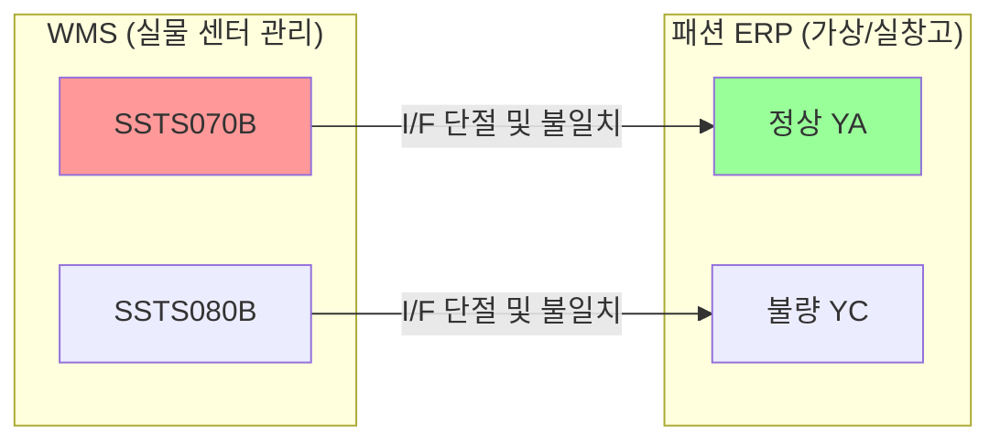

# WMS센터별패션창고재고관리_팀장검토진행건 요약

이 문서는 [원문 PPTX 텍스트](file:///C:/supersonic/llm_wiki/raw/sources/extracted/wms-c970d3195f_extracted.txt)를 바탕으로, WMS 도입 이후 패션 ERP 간에 발생하는 창고 재고 및 수불 이격 문제를 해결하기 위한 추진 과제를 **4단계 PI 프레임워크(As-Is, To-Be, Gap, 해결방안)**에 맞춰 요약한 지식 카드입니다.

---

## 🧭 WMS-ERP 창고 재고 정렬 4단계 PI 분석

### 1. WMS 개별 센터와 ERP 가상 창고 간 수불 이격

* **As-Is (현행)**:
  * WMS는 실물 Zone(정상, 불량 등) 기반의 개별 센터로 재고를 운영하는 반면, 패션 ERP는 실물 창고 외에 `YA`(정상), `YC`(불량) 등 비실물성 가상 창고 코드를 혼용하여 시스템 간 수불 이격이 누적되고 있습니다.
  * 전체 물류센터별 창고 수불을 한눈에 조회할 수 있는 통합 뷰어가 부재하여 담당자가 엑셀로 전수 취합해 파악합니다.
  * WMS 센터 간 재고 이동 데이터의 ERP 인터페이스가 누락되어 전산과 실재고의 이격이 심화됩니다.
* **To-Be (목표)**: WMS 센터 코드와 ERP 창고 코드의 1:1 일원화, 센터 간 재고 이동 데이터의 100% 자동 연동, 전사 통합 창고 수불 가시성 확보.
* **Gap (격차)**: 두 시스템 간 창고 마스터 설계 비표준, 센터 간 이동 트랜잭션 수집 스케줄러 누락, 준실시간 재고 조회를 위한 공통 데이터 파이프라인 결여.
* **RFP 해결방안**:
  * **WMS 센터코드 매핑 표준화**: 모든 패션 ERP 전표 생성 및 입출고 실적 발생 시 WMS 센터 코드를 필수적으로 맵핑하도록 표준 트랜잭션 개편.
  * **WMS 센터간 이동 I/F 구현**: WMS에서 발생하는 센터 간 재고 이동 실적을 주기적으로 ERP로 전송하여 수불 및 재고를 동기화하는 인터페이스 추가.

---

### 2. B2C 온라인 센터의 매장코드 편법 관리

* **As-Is (현행)**:
  * B2C(온라인) 물류 재고를 관리하기 위해 ERP에서 실물 창고 코드가 아닌 '매장코드'로 변형하여 등록 및 관리함으로써, 재고 정산 및 수불 흐름 분석에 큰 혼선과 데이터 품질 저하를 초래합니다.
* **To-Be (목표)**: 온라인 센터 재고를 명확한 'B2C 실물 창고코드'로 귀속시켜 매장 재고와 창고 재고의 경계를 확실히 분리.
* **Gap (격차)**: 온라인 전용 수불 로직의 미비 및 온라인 정산 업무의 ERP 귀속 부적합.
* **RFP 해결방안**:
  * B2C 센터의 기존 가상 매장코드를 **정식 창고코드(B2C WH)로 전면 전환**.
  * 온라인 출고/반품 시 매장 수불이 아닌 **창고 수불 유형**으로 트랜잭션이 작동하도록 연계 I/F 프로세스를 재설계하고 정산 프로세스를 이관 처리.

---

### 3. 실시간 재고 상태값 구분 및 가시성 부재

* **As-Is (현행)**:
  * 전일 마감 재고 기준으로만 현황 조회가 가능하며, WMS 입고 확정 전 단계의 '이동 중 재고'나 '실재고', '전산재고'의 상세 정보가 분리 관리되지 못해 준실시간 의사결정이 불가능합니다.
* **To-Be (목표)**: 준실시간(Near Real-time) 재고 추적성 및 이동중재고/실재고/전산재고의 속성 분리 조회 보장.
* **Gap (격차)**: 실시간 수불 트래킹 레이어 부재 및 조회 화면의 미개발.
* **RFP 해결방안**:
  * WMS 입고 센터 확정 전 데이터 흐름을 추적할 수 있도록 **[기초 - 입고 - 자가소모 - 출고 - 센터이동 - 이동재고 - 실재고 - 전산재고]** 구조로 데이터 테이블을 다차원 재구성.
  * 일별/월별 조회가 가능하며 브랜드 및 제품별로 실시간 현황을 제공하는 **'통합 창고 수불 모니터링 대시보드'** 화면 신규 구축.

---

## 🔗 연계 지식 카드 (Obsidian Links)

* **상위 개념**: [[wms-fone-inventory-integration|WMS-FONE 재고 연계]], [[fone-as-is-analysis|FONE 현행 분석]]
* **연계 프로세스**: [[store-master-data-cleanup|매장 기준정보 정비]], [[master-data-governance|기준정보 관리 체계]], [[sales-settlement-automation|영업관리 정산 자동화]]
* **연계 엔티티**: [[wms|WMS]], [[fa-one-fone|FA-ONE & FONE ERP]]
