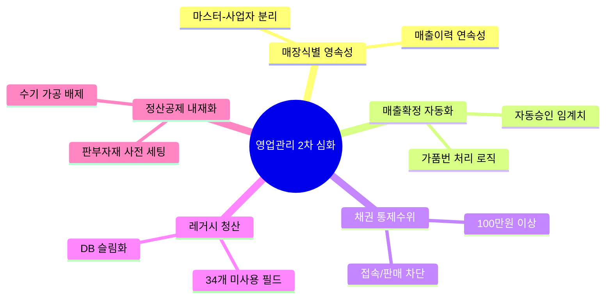

# 영업관리 2차 심화인터뷰 질문지 요약

이 문서는 [원문 엑셀 파일](file:///C:/supersonic/llm_wiki/raw/sources/영업관리_2차_심화인터뷰_질문지.xlsx)의 '2차 심화 인터뷰 질의서' 시트를 분석하여, 차세대 영업관리 시스템 구축을 위한 **5대 핵심 쟁점(의사결정 사항)**과 **업무 영역별 상세 질문 리스트**를 정리한 지식 카드입니다.

---

## 🎯 5대 핵심 쟁점 및 의사결정 분석 (PI 관점)

인터뷰 대상 현업(영업관리팀 등)과의 합의 및 차세대 설계 방향 결정을 위한 5가지 핵심 아젠다입니다.

### 1. 매장 식별 체계의 영속성 확보 (ST-01, ST-02)
* **핵심 질문**: 점주나 사업자가 바뀌어도 해당 물리적 매장의 역사적 매출 데이터는 중단 없이 추적되어야 하는가?
* **PI 핵심 논점**: 기존 ERP에서는 사업자번호 변경 시 기존 코드를 폐기하고 신규 코드를 발행하여 매출 분석 시 시계열 단절이 발생했습니다.
* **설계 방향 (To-Be)**: 매장 마스터(거점 키)와 사업자 정보를 1:N 관계로 분리하여 관리하는 구조의 정당성 확보.

### 2. 매출 확정의 '완전 자동화' 임계치 설정 (SA-01, SA-02, SA-03)
* **핵심 질문**: 시스템이 자동으로 매출 전표를 대조하고 확정 지을 수 있는 오차 범위(가품번 차액 조정 임계치)는 얼마인가?
* **PI 핵심 논점**: 수만 건의 대조 작업을 수작업에서 예외 관리로 전환하기 위해서는 "자동 상계 허용 액수(예: 1원 단위, 100원 단위 등)"에 대한 현업의 수용 기준이 선행 설정되어야 합니다.
* **목표 가치**: 월 100시간 이상 소요되던 대조 작업 시간을 90% 이상 대폭 감축.

### 3. 장기 미수 방지를 위한 강력한 통제권 설정 (AR-02)
* **핵심 질문**: 100만 원 이상 미수 발생 시 단순 팝업 알림으로 제한할 것인가, 아니면 판매 및 시스템 접속을 물리적으로 차단(Auto-Blocking)할 것인가?
* **PI 핵심 논점**: 현업은 현장의 융통성을 위해 단순 '경고 팝업'을 선호하지만, 본사 리스크 관리 관점에서는 확실한 차단 정책(Hard Blocking)이 수반되어야 채권 사고를 예방할 수 있습니다.
* **설계 방향 (To-Be)**: 리스크 수준에 따른 3단계 시스템적 제어 메커니즘 구축.

### 4. 레거시(Legacy) 청산 및 데이터 슬림화 (ET-01)
* **핵심 질문**: 2018년 이후 미사용된 34개의 필드를 차세대 DB에서 완전히 영구 삭제해도 소급 분석에 지장이 없는가?
* **PI 핵심 논점**: 시스템 현대화 및 쿼리 성능 향상을 위해 미사용 필드 및 쓰레기 데이터를 과감히 제거하는 최종 합의 유도.

### 5. 수수료 및 공제 항목의 '시스템 내재화' (CM-01, CM-03)
* **핵심 질문**: 판촉비, AS 수선비 등 수수료 정산 시 발생하는 공제액을 엑셀 편집 없이 시스템에서 사전 세팅(Pre-set)하여 차감할 수 있는가?
* **PI 핵심 논점**: 정산 프로세스에서 수기 엑셀 개입을 제거하기 위해 공제 예외 케이스의 기준 정보를 시스템 마스터 데이터화하는 작업이 선행되어야 합니다.

---

## 📋 영역별 상세 심화 질문 리스트

| 카테고리 | ID | 요청사항 (Raw Data) | 심화 질문 (타당성 및 로직 확인) |
| :--- | :--- | :--- | :--- |
| **매장관리** | **ST-01** | 매장 식별키의 매장코드 전환 | 사업자 변경 시 기존 코드를 유지해야 하는 가장 결정적인 이유는? (매출 분석, 채권 추적 등) |
| | **ST-02** | AIS 종사업장 정보 자동 연동 | 수기 입력 시 발생하는 오류 유형과 그로 인한 재처리 시간은? |
| | **ST-03** | 매장 전용 관리 화면 신설 | 엑셀 별도 관리 데이터가 시스템화될 때 타 부서(회계/물류) 공유 필요성은? |
| | **ST-04** | 유통망별 정산 세부 정보 강화 | 미수 관리를 위해 시스템에 추가되어야 할 유통망별 필수 필드는? |
| **매출/정산** | **SA-01** | VAN사/머니온 데이터 자동 연동 | 매출 확정 시 VAN사 데이터와 POS 실적 불일치 빈도 및 주된 원인은? |
| | **SA-02** | 매출 차액 자동 조정 (가품번) | 원단위 차액 등 시스템 자동 처리를 허용할 수 있는 오차 범위(Max 금액)는? |
| | **SA-03** | 유통망 EDI 직접 연동 및 검증 | 직접 연동 시 데이터 검증 로직에서 가장 중요하게 체크해야 할 항목은? |
| | **SA-04** | 마진/할인율 일괄 복사 기능 | 마진 복사 시 예외 사항(특정 상품 제외 등) 처리를 위한 기능 필요 여부는? |
| **중간관리** | **CM-01** | 수수료율 이력 및 권한 관리 | 오지급 사례가 있는가? 이력 외에 별도의 승인 절차가 필요한가? |
| | **CM-02** | 트러스빌 연동 역발행 자동화 | 수수료 정산 후 트러스빌 연동 시 수기로 가공하는 항목은? |
| | **CM-03** | 공제 항목 사전 세팅 및 반영 | 공제 금액 자동 반영 시 담당자가 최종 확인/수정하는 단계가 필요한가? |
| **채권/미수** | **AR-01** | 입금 예정일 기반 자동 차액 체크 | 매입사별 입금일 변동 시 시스템 알림을 어떻게 구분하여 주어야 하는가? |
| | **AR-02** | 현금 미수 100만 원 이상 알림 | 알림 팝업 대상자 범위와 강제 로그인 제한 기능 필요 여부는? |
| | **AR-03** | 실시간 입금 반영 (AIS 연동) | 실시간 반영 미비로 발생하는 구체적인 업무 지장은? |
| **재고/기타** | **IV-01** | 가상 창고(X, OA) 최적화 | 가상 창고 폐지 후 '상태값' 관리 시 현장 조회 방식 변경 수용 가능한가? |
| | **IV-02** | 다년차 재고 통합 조회 | 조회 기간을 '시작~종료일'로 지정 시 성능 저하 방지용 필수 필터는? |
| | **DS-01** | 영업관리 통합 보고서/대시보드 | 수기 보고서 중 가장 먼저 시스템화되어야 할 양식 1순위는? |
| **기타** | **ET-01** | 미사용 필드 제거 / 탭분리 NEEDS | 2018년 이후 사용하지 않는 34개 필드 제거 삭제에 대한 의견 (분석, 소급 적용 관련 확인 필요) |
| | **ET-02** | 매장 분류 체계 재확인 | 매장 관리에서 사용하는 매장 분류 체계 외 별도 관리하는 자료가 있는지 확인 (영향도 확인) |
| | **ET-03** | 매장 폐점 상태 | 매장 실 폐점 이후에도 기타 관리를 위해 매장을 활성상태로 유지하는 케이스 확인 |
| | **ET-04** | 법인 별 차이 내역 확인 | 신성통상 - 에이션 패션 차이점 확인 (관리 내역 외) |
| | **ET-05** | 글로벌 법인 관리 | 신규 글로벌 법인에 대한 대책 / 관리 방안 |

---

## 🔗 연계 지식 카드 (Obsidian Links)
* **상위 개념**: [[master-data-governance|기준정보 관리 체계]], [[sales-settlement-automation|영업관리 정산 자동화]]
* **요구사항 연계**: [[영업관리_RFP_요구사항_정의서_최종|영업관리 RFP 요구사항 정의서 (최종)]]
* **관련 의사결정**: [[fone-next-decisions|FONE 다음 의사결정]]
