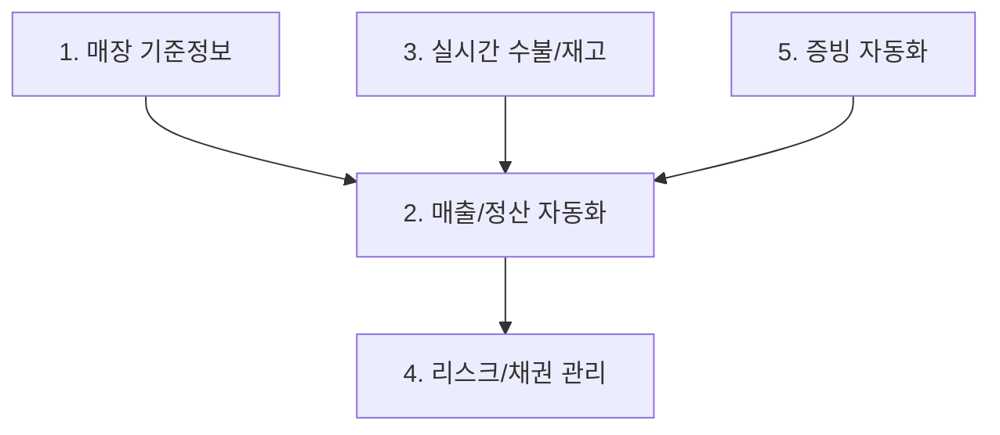

# 차세대 패션 ERP(F-ONE) 영업관리 요구사항 정의서 (RFP) 요약

이 문서는 [원문 HTML](file:///C:/supersonic/llm_wiki/raw/sources/영업관리_RFP_요구사항_정의서_최종.html)에서 추출한 영업관리 차세대 ERP 핵심 요구사항 7건을 신성통상 표준 **4단계 PI 분석 프레임워크 (As-Is, To-Be, Gap, 해결방안)**에 맞춰 유기적으로 재구성한 지식 카드입니다.

---

## 🗺️ 영역별 요구사항 요약 및 4단계 분석

### 1. 매장 기준정보 및 이력 관리

#### 📌 REQ-MDM-001: 위치 기반 고유 매장코드 및 SCD 이력 관리 엔진
* **As-Is (현행)**: 점주 변경 또는 사업자 정보 변경 시 매장코드를 신규로 재채번하여 이전 매장 데이터와의 역사적 연속성이 단절됨. 이로 인해 동일 거점의 장기 매출 시계열 분석 시 데이터 단절 및 통계 왜곡 발생.
* **To-Be (목표)**: 사업자 정보와 무관하게 특정 지리적/물리적 위치를 대표하는 **'영구 매장코드'**를 구축하고, 하위 속성을 이력 관리함.
* **Gap (격차)**: 물리적 거점 관리 키(PK)의 부재 및 데이터베이스 차원의 속성 이력 누적 관리(SCD Type 2) 기능 결여.
* **RFP 해결방안**: 
  - 물리적 거점 중심의 고유 코드를 PK로 설정.
  - **SCD(Slowly Changing Dimension) Type 2**를 적용하여 점주명, 면적, 계약 조건 변경 시 유효 시작/종료일 기반으로 타임스탬프 이력 누적.
  - 특정 과거 시점 조회 시 해당 시점의 매장 매핑 정보를 자동 호출하는 시계열 뷰 기능 구현.

#### 📌 REQ-MDM-002: 부서별 입력 탭(Tab) 기반 데이터 거버넌스
* **As-Is (현행)**: 매장 정보 등록 시 하나의 화면에 모든 정보가 노출되어 타 부서가 입력해야 할 필드를 영업 부서가 수기 파악하여 공유하거나, 오입력 및 누락이 빈번하게 발생함.
* **To-Be (목표)**: 영업, 회계, 물류 등 업무 도메인별 입력 영역이 명확히 차단되고 단계별 승인을 거쳐 매장 마스터 정보가 최종 생성됨.
* **Gap (격차)**: 부서별 권한에 따른 필드 레벨의 제어 메커니즘 및 마스터 등록을 통제하는 워크플로우 엔진 부재.
* **RFP 해결방안**:
  - 화면 UI 상 부서별 입력 탭(Tab)을 분리하고 권한에 따라 Read/Write 제어.
  - 필수 필드 미입력 시 다음 부서로의 이관을 차단하는 **Workflow 승인 프로세스** 강제화.

---

### 2. 매출 확정 및 자동 정산 엔진

#### 📌 REQ-SLS-001: Integration Hub 기반 매출/VAN 데이터 수집 엔진
* **As-Is (현행)**: 롯데/현대/신세계 등 각 유통망 백오피스 웹사이트에 개별 접속하여 정산 및 매출 엑셀 데이터를 수기 다운로드하고, 이를 ERP 업로드용 템플릿으로 재가공하여 업로드함.
* **To-Be (목표)**: 유통망 EDI 및 금융망 API와 실시간/스케줄러 연동을 통해 매출 및 수수료 데이터를 자동 수집 및 정규화(ETL).
* **Gap (격차)**: 외부 시스템 연동을 위한 표준 연계 인터페이스 엔진 및 ETL 모듈의 부재.
* **RFP 해결방안**:
  - 주요 백화점/쇼핑몰 **EDI 데이터 스케줄링 수집 및 파싱 엔진** 구축.
  - 카드사 및 VAN사 입금 데이터 연동 API 확보.

#### 📌 REQ-SLS-002: 3-Way Auto-Matching 및 예외 관리 대시보드
* **As-Is (현행)**: 수집된 유통망 정산 데이터와 내부 ERP 매출, 실제 금융 통장 입금액 간의 차이 조정을 위해 정산 담당자가 수만 행의 엑셀 데이터를 VLOOKUP 등을 사용해 수작업으로 전수 대조함.
* **To-Be (목표)**: 정합성이 일치하는 90% 이상의 정상 건은 시스템이 Zero-Touch로 자동 승인 확정하고, 불일치하는 예외(10%) 건만 담당자가 추적 조정하는 구조로 전환.
* **Gap (격차)**: 다차원 매출 데이터 자동 비교 알고리즘 및 불일치 사유 자동 매핑 대시보드 부재.
* **RFP 해결방안**:
  - **[내부 ERP 매출] - [유통망 정산액] - [실제 입금액]**의 3자간 자동 대조 엔진 설계.
  - 예외 사유(취소 시점 차이, 임의 할인, 수수료율 오차 등) 자동 분석 및 조정 전표 자동 생성 모듈 구현.

---

### 3. 실시간 재고 가시성 및 수불 관리

#### 📌 REQ-INV-001: Hub-Spoke 실시간 논리적 수불 엔진
* **As-Is (현행)**: 거점 매장(백화점 등)과 종속 매장(상설/행사장) 간에 재고 이동 시 매번 '점간 이동' 전표를 수기로 입력해야 하며, 실시간 판매 시 실제 재고와 시스템 재고의 불일치로 판매 기회 손실 발생.
* **To-Be (목표)**: 물리적으로는 나누어져 있으나 논리적으로 묶인 매장 그룹 간의 재고 수불을 실시간으로 차감 및 배분함.
* **Gap (격차)**: 다차원 수불 계층 모델 및 실시간 논리적 가상 창고 제어 로직 부재.
* **RFP 해결방안**:
  - 거점(Hub)-종속(Spoke) 매장 간 논리적 계층 정의 기능.
  - 종속 매장 판매 발생 시 거점 매장 재고 자동 실시간 차감 및 매출 배분 로직 구현.
  - 가상 창고 경유 없이 직접적인 점간 이동(RT) 트랜잭션 실시간 처리.

#### 📌 REQ-INV-002: 현장 완결형 자가소모 직접 처리 프로세스
* **As-Is (현행)**: 매장에서 고객 증정품, 마네킹 착장용 비품 등으로 자가소모 처리할 때, 실질적인 재고 정리를 위해 물류창고로 가상 반품을 잡거나 본사 승인 메일을 보낸 뒤 수기 조정 전표를 생성해야 함.
* **To-Be (목표)**: 매장 현장에서 완결형으로 자가소모 처리를 하고 회계 세무 전표가 자동 발행되는 모듈 구현.
* **Gap (격차)**: POS/스마트 단말기를 통한 매장 자가소모 입력 인터페이스 및 회계 자동 분개 연동 부재.
* **RFP 해결방안**:
  - POS/모바일 앱 내 매장 자가소모 처리 인터페이스 및 사유 코드 관리 기능.
  - 등록 즉시 해당 비용 계정(판촉비 등)으로 전표 자동 연동.

---

### 4. 액티브 리스크 및 채권 모니터링

#### 📌 REQ-ACC-001: CMS 연동 실시간 채권 상계 및 자동 판매 제어
* **As-Is (현행)**: 매장의 담보 한도 초과 또는 채권 미수금이 쌓여도 매출 마감 및 회계 전표가 확정(D+1~D+2)되기 전까지는 한도 초과 여부를 시스템적으로 파악하기 어려워 부실 매장에 대한 추가 출고 및 판매가 계속 진행됨.
* **To-Be (목표)**: 금융 가상계좌(CMS) 입금 수신 즉시 실시간 채권을 상계하고 한도 초과 시 시스템이 출고/판매 기능을 자동 차단함.
* **Gap (격차)**: CMS 금융 연동 실시간성 부재 및 POS 단말기의 임계치 기반 Auto-Blocking 제어 엔진 부재.
* **RFP 해결방안**:
  - CMS 가상계좌 입금 데이터 수신 즉시 ERP 채권 실시간 상계(Real-time Offset).
  - 리스크 수준별 3단계 자동 제어: 1단계(경고) ➡️ 2단계(신규 출고/판매 제한) ➡️ 3단계(시스템 접속 차단).

---

### 5. 증빙 자동화 및 연동 관리

#### 📌 REQ-DOC-001: Trustbill API 연동 및 정산 공제 통합 인터페이스
* **As-Is (현행)**: 정산 시 매장에서 발생한 소모품비, 수선비 등 각종 공제 비용을 수기로 대조한 뒤 역발행 세 세금계산서 발행 시스템(Trustbill 등)에 개별 로그인하여 세금계산서를 끊고 증빙을 수동 관리함.
* **To-Be (목표)**: 정산 확정과 동시에 Trustbill API를 통해 세금계산서가 발행되며, 정산 공제 내역이 자동으로 정산서에 반영 및 증빙 통합 보관.
* **Gap (격차)**: 외부 전자세금계산서 발행 솔루션 연동 API 부재 및 타 부서 발생 공제 비용의 연동 자동화 미비.
* **RFP 해결방안**:
  - Trustbill API 연동 전자세금계산서 자동 역발행 모듈.
  - 타 부서 비용 발생 데이터(소모품 신청, AS 수선비 등) 자동 공제 반영 연계 인터페이스 구축.
  - ERP 회계 전표 화면 내 국세청 전송 상태 및 PDF 증빙 통합 뷰어 탑재.

---

## 🔗 연계 지식 카드 (Obsidian Links)
* **상위 개념**: [[sales-settlement-automation|영업관리 정산 자동화]], [[master-data-governance|기준정보 관리 체계]]
* **연계 시스템**: [[fa-one-fone|FA-ONE/FONE ERP]], [[wms|WMS 창고관리]]
* **관련 질문**: [[fone-next-decisions|FONE 다음 의사결정]]
